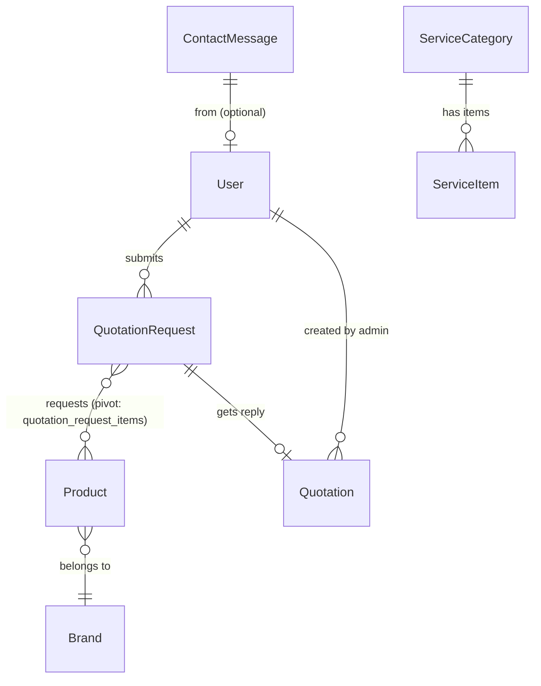
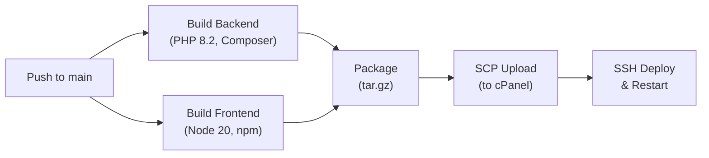

# TiTEC Automation Website — Architecture Overview

> **Project**: TiTEC Automation — Industrial automation company website + admin panel  
> **Domain**: `titecautomation.lk`  
> **Stack**: Next.js 16 (Frontend) ↔ Laravel 12 (Backend API)  
> **Last Updated**: August 2026

---

## High-Level Architecture

```
┌─────────────────────────────────────────────────────────────┐
│                     PRODUCTION (cPanel)                      │
│                                                              │
│  ┌──────────────────────┐     ┌───────────────────────────┐  │
│  │    frontend-next     │────▶│     backend-laravel       │  │
│  │   (Next.js 16 SSR)   │ API │     (Laravel 12 API)      │  │
│  │   Port 3000          │◀────│     Port 8000             │  │
│  │   node server.js     │     │     php artisan serve     │  │
│  └──────────────────────┘     └──────────┬────────────────┘  │
│                                          │                   │
│                                   ┌──────▼──────┐            │
│                                   │   MySQL DB   │            │
│                                   └─────────────┘            │
└─────────────────────────────────────────────────────────────┘
```

### Communication Pattern

- **Client → Server**: REST API over HTTPS
- **Auth**: Laravel Sanctum **bearer tokens** (not cookie-based SPA auth)
- **Token storage**: `localStorage` on frontend
- **CORS**: Configured for `localhost:3000`, `127.0.0.1:3000`, and `titecautomation.lk`
- **CSRF**: Disabled for all `api/*` routes

---

## Repository Structure

```
Titec-Automation-website-m3-first/
├── .AI/                    ← You are here (AI docs)
├── .github/                ← GitHub workflows
├── frontend-next/          ← Next.js 16 frontend (React 19)
│   ├── src/
│   │   ├── app/            ← App Router pages
│   │   │   ├── (admin)/    ← Admin panel (noindex)
│   │   │   └── (client)/   ← Public website (SEO-enabled)
│   │   ├── components/     ← React components
│   │   │   ├── admin/      ← Admin CRUD modals & tables
│   │   │   ├── client/     ← Client-facing page sections
│   │   │   └── ui/         ← Reusable primitives (Button, Card, etc.)
│   │   ├── context/        ← AuthContext, CartContext
│   │   ├── services/       ← API service modules (Axios-based)
│   │   ├── lib/            ← Axios instance, cn() utility
│   │   ├── types/          ← TypeScript interfaces
│   │   ├── hooks/          ← Custom hooks (useLocalStorage)
│   │   ├── utils/          ← Image/slug utilities
│   │   ├── data/           ← Static service data
│   │   └── assets/         ← Static images
│   ├── public/             ← Public assets (logos, hero images)
│   ├── server.js           ← Custom HTTP server for cPanel
│   ├── next.config.js      ← Next.js config
│   └── package.json
│
└── backend-laravel/        ← Laravel 12 API backend
    ├── app/
    │   ├── Http/
    │   │   ├── Controllers/ ← 10 API controllers
    │   │   ├── Middleware/   ← CSRF + Cookie encryption
    │   │   └── Resources/   ← API Resources (ProductResource, QuotationRequestResource)
    │   ├── Models/          ← 9 Eloquent models
    │   ├── Mail/            ← 5 Mailable classes
    │   └── Providers/
    ├── config/              ← App, auth, CORS, Sanctum, mail, etc.
    ├── database/
    │   ├── migrations/      ← 25 migrations
    │   └── seeders/         ← 9 seeders
    ├── routes/
    │   └── api.php          ← All API route definitions
    ├── resources/views/     ← Blade templates (PDF/email)
    ├── storage/             ← Uploaded files, logs
    └── composer.json
```

---

## Technology Stack

### Frontend (`frontend-next`)

| Technology          | Version | Purpose                              |
|---------------------|---------|--------------------------------------|
| Next.js             | 16.x    | React framework with App Router      |
| React               | 19.x    | UI library                           |
| TypeScript          | 5.x     | Type safety                          |
| Tailwind CSS        | 4.x     | Utility-first CSS (PostCSS plugin)   |
| Framer Motion       | 12.x    | Animations & transitions             |
| Axios               | 1.x     | HTTP client for API calls            |
| Lucide React        | 0.562   | Icon library                         |
| Sonner              | 2.x     | Toast notifications                  |
| date-fns            | 4.x     | Date formatting                      |
| clsx + tailwind-merge |       | Conditional className merging (`cn`)|
| Google Maps         | -       | `@vis.gl/react-google-maps`          |

### SEO, AI Crawlability & Performance (Frontend)

#### Server-Side Rendering Strategy
- **SSR + ISR**: Product pages use `generateStaticParams()` for build-time pre-rendering with ISR (`revalidate = 60s`). Store listing revalidates every 5 minutes.
- **Server-Rendered HTML for Crawlers**: Product detail and store listing pages include server-rendered HTML content (product names, descriptions, prices, specs) directly in the page component. This ensures AI crawlers (GPTBot, ClaudeBot, PerplexityBot) that don't execute JavaScript can still read all product data.
- **Dual-Render Pattern**: Interactive UI is handled by `"use client"` components, while crawlable content is rendered in the server component above them. Product detail pages use an `sr-only` article; the store listing includes a visible "Complete Product Catalog" section.

#### Dynamic Metadata
- `generateMetadata()` populates page-specific `<title>`, `<meta description>`, Open Graph, and Twitter card tags from live product/project data.
- Canonical URLs set via `alternates.canonical` to prevent duplicate content issues.

#### JSON-LD Structured Data
| Page | Schema Types | Purpose |
|------|-------------|----------|
| Layout (global) | `Organization`, `LocalBusiness` | Company identity, contact, geo |
| `/store` | `ItemList`, `BreadcrumbList` | Product carousel in search results |
| `/store/[slug]` | `Product` (with `Offer`, `Brand`, `shippingDetails`), `BreadcrumbList` | Rich product snippets |
| `/projects` | `CreativeWork`, `ItemList` | Project portfolio visibility |
| `/faq` | `FAQPage` | FAQ rich snippets |

#### AI Chatbot Discovery
- **`/llms.txt`** — Static file describing the site, key pages, and links to the product feed. Follows the emerging `llms.txt` convention.
- **`/llms-full.txt`** — Dynamic route generating a full plain-text product catalog (revalidates hourly). AI crawlers ingest this for complete product knowledge.

#### robots.txt
Configured in `src/app/robots.ts` with explicit `allow` rules for 9 AI crawler user agents: `GPTBot`, `ChatGPT-User`, `Google-Extended`, `ClaudeBot`, `PerplexityBot`, `meta-externalagent`, `Applebot-Extended`, `CCBot`, `cohere-ai`. Admin, API, and customer-dashboard paths are disallowed for all.

#### Sitemap
Dynamic `src/app/sitemap.ts` generates entries for all static pages + all product pages + all project pages with appropriate `changeFrequency` and `priority` values.

#### Cache Headers (`next.config.js`)
| Path Pattern | Cache-Control | Rationale |
|---|---|---|
| `/store/*`, `/projects/*`, `/services/*`, etc. | `public, max-age=60, s-maxage=300, stale-while-revalidate=600` | Crawler-friendly caching |
| `/llms*` | `public, max-age=3600, s-maxage=86400` | Long cache for AI feeds |
| `/admin/*`, `/api/*`, `/customer-dashboard/*` | `no-store, must-revalidate` | Private routes |

### Backend (`backend-laravel`)

| Technology       | Version | Purpose                           |
|------------------|---------|-----------------------------------|
| PHP              | 8.2+    | Runtime                           |
| Laravel          | 12.x    | API framework                     |
| Laravel Sanctum  | 4.x     | Bearer token authentication       |
| DomPDF           | 3.x     | PDF generation for quotations     |
| MySQL            | -       | Primary database                  |
| Queue (database) | -       | Email/job queue                   |
| Cache (database) | -       | Application cache                 |

---

## User Roles & Access

| Role       | Access Areas                                                   |
|------------|----------------------------------------------------------------|
| **Admin**  | Full admin panel: Dashboard, Products, Projects, Brands, Services, Quotations, Settings |
| **Customer** | Public website, Store, Product browsing, Quotation requests   |
| **Guest**  | Public website, Contact form, Quotation requests (limited)     |

---

## Key Business Flows

### 1. Quotation Request Flow
```
Customer browses store → Adds products to cart (localStorage)
→ Submits quotation request with contact info
→ Backend saves request + email notification to admin
→ Admin views request in panel → Replies with quotation PDF
→ Quotation PDF emailed to customer
```

### 2. Admin Content Management
```
Admin logs in via /admin/login (Sanctum token)
→ CRUD operations on: Products, Projects, Brands, Services
→ All changes reflect on public website via SSR/API
```

### 3. Authentication Flow
```
Admin login → POST /api/login → receives bearer token
→ Token stored in localStorage (also inside user JSON)
→ Axios interceptor attaches `Authorization: Bearer <token>`
→ 401 response → auto-redirect to /admin/login + clear storage
```

---

## Database Entity Relationships



### Models Summary

| Model | Fillable Fields | Casts | Relationships |
|---|---|---|---|
| `User` | name, email, password, role | email_verified_at→datetime, password→hashed | hasMany QuotationRequests, hasMany Quotations (as admin) |
| `Product` | name, model_number, slug, description, price, stock, unit, category, brand, sku, images, datasheet_path, stock_status, on_store, brand_id, show_price | images→array, price→decimal:2, on_store→boolean, show_price→boolean | belongsTo Brand, belongsToMany QuotationRequest (pivot: quotation_request_items with quantity) |
| `Brand` | name, slug, logo_path | — | hasMany Products |
| `Project` | title, client, location, description, completion_date, status, technologies, thumbnail_path, logo_path, project_image_urls | completion_date→date, technologies→array, project_image_urls→array | — |
| `ServiceCategory` | title, slug, description, image_path, sort_order | — | hasMany ServiceItems |
| `ServiceItem` | title, description, sort_order, service_category_id | — | belongsTo ServiceCategory |
| `QuotationRequest` | name, email, phone, customer_notes, status, file_path | — | belongsTo User, belongsToMany Products (pivot: quotation_request_items with quantity), hasOne Quotation |
| `Quotation` | quotation_request_id, admin_id, grand_total, pdf_path, valid_until, remarks | valid_until→date | belongsTo QuotationRequest, belongsTo User (as admin) |
| `ContactMessage` | name, company, email, phone, message | — | — |

---

## Environment Variables

### Frontend (`.env`)
```
NEXT_PUBLIC_BACKEND_URL=https://api.titecautomation.lk   # Backend API base URL
NEXT_PUBLIC_APP_URL=https://titecautomation.lk           # Public app URL (for SEO)
```

### Backend (`.env`)
```
APP_URL=                              # Application URL
DB_CONNECTION=mysql                   # Database driver
DB_HOST= / DB_PORT= / DB_DATABASE=   # Database connection
MAIL_MAILER=                          # Email driver (smtp/log)
MAIL_SALES_ADDRESS=                   # Sales notification email
SANCTUM_STATEFUL_DOMAINS=             # Allowed SPA domains
```

---

## Deployment Notes

- **Hosting**: cPanel shared hosting
- **Frontend**: Runs via custom `server.js` (Node.js HTTP server wrapping Next.js)
- **Backend**: Standard Laravel on Apache/PHP-FPM
- **Images**: Stored in `storage/app/public`, linked via `php artisan storage:link`
- **Build**: `next build --webpack` (webpack mode, not turbopack)
- **Image optimization**: Disabled (`unoptimized: true`) due to missing Sharp on cPanel
- **Cache headers**: Per-route caching — public pages use `public, max-age=60, s-maxage=300` for crawler-friendliness; admin/API routes use `no-store, must-revalidate`

---

## CI/CD Pipeline (GitHub Actions)

A fully automated "Zip & Ship" deployment pipeline is configured via `.github/workflows/deploy.yml`. It triggers automatically on pushes to the `main` branch.

### Pipeline Flow



### Pipeline Stages

| Stage | Action | Tools/Commands |
|-------|--------|----------------|
| **1. Checkout** | Clone repository | `actions/checkout@v4` |
| **2. Build Backend** | Install PHP deps (production only) | `shivammathur/setup-php@v2` (PHP 8.2), `composer install --no-dev --optimize-autoloader --prefer-dist --ignore-platform-reqs` |
| **3. Build Frontend** | Install npm deps, build Next.js, remove `node_modules` | `actions/setup-node@v4` (Node 20), `npm install && npm run build && rm -rf node_modules` |
| **4. Package** | Create compressed archive excluding `.git`, `.env`, logs | `tar -czf deploy_package.tar.gz` |
| **5. Upload** | SCP archive to cPanel server | `appleboy/scp-action@master` |
| **6. Deploy & Restart** | Extract, migrate, cache, restart | `appleboy/ssh-action@master` — see below |

### Deploy & Restart Steps (Stage 6)
1. `pkill -u <user> node` — Force kill old Node processes (ghost process cleanup)
2. `rm -rf frontend-next/.next` — Remove stale build artifacts
3. `tar -xzf deploy_package.tar.gz` — Extract and overwrite
4. `php artisan migrate --force` — Run database migrations
5. `php artisan config:clear && cache:clear && config:cache` — Reset Laravel caches
6. `npm install --production` — Install frontend production dependencies
7. `touch tmp/restart.txt` — Trigger Phusion Passenger restart

### Required GitHub Secrets

| Secret | Purpose |
|--------|----------|
| `NEXT_PUBLIC_BACKEND_URL` | Backend API URL injected during frontend build |
| `HOST_IP` | cPanel server IP address |
| `CPANEL_USER` | cPanel SSH username |
| `SSH_PRIVATE_KEY` | SSH private key for server access |
| `REMOTE_PORT` | SSH port number |
