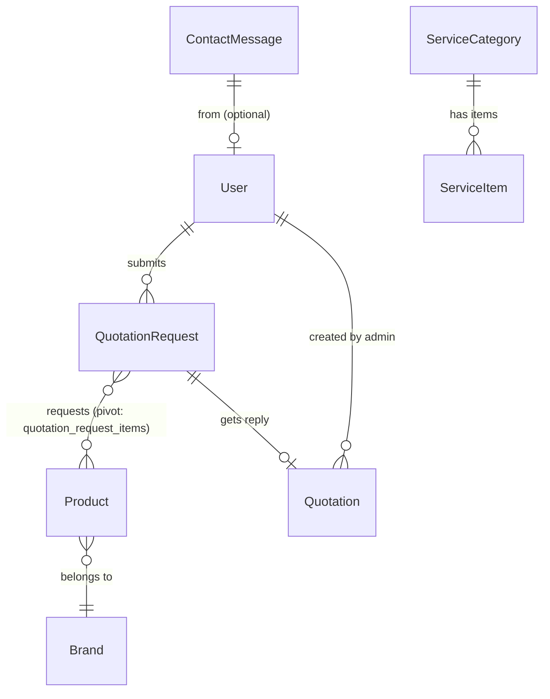

# TiTEC Automation Website — Architecture Overview

> **Project**: TiTEC Automation — Industrial automation company website + admin panel  
> **Domain**: `titecautomation.lk`  
> **Stack**: Next.js 16 (Frontend) ↔ Laravel 12 (Backend API)  
> **Last Updated**: March 2026

---

## High-Level Architecture

```
┌─────────────────────────────────────────────────────────────┐
│                     PRODUCTION (cPanel)                      │
│                                                              │
│  ┌──────────────────────┐     ┌───────────────────────────┐  │
│  │    frontend-next     │────▶│     backend-laravel       │  │
│  │   (Next.js 16 SSR)   │ API │     (Laravel 12 API)      │  │
│  │   Port 3000          │◀────│     Port 8000             │  │
│  │   node server.js     │     │     php artisan serve     │  │
│  └──────────────────────┘     └──────────┬────────────────┘  │
│                                          │                   │
│                                   ┌──────▼──────┐            │
│                                   │   MySQL DB   │            │
│                                   └─────────────┘            │
└─────────────────────────────────────────────────────────────┘
```

### Communication Pattern

- **Client → Server**: REST API over HTTPS
- **Auth**: Laravel Sanctum **bearer tokens** (not cookie-based SPA auth)
- **Token storage**: `localStorage` on frontend
- **CORS**: Configured for `localhost:3000`, `127.0.0.1:3000`, and `titecautomation.lk`
- **CSRF**: Disabled for all `api/*` routes

---

## Repository Structure

```
Titec-Automation-website-m3-first/
├── .AI/                    ← You are here (AI docs)
├── .github/                ← GitHub workflows
├── frontend-next/          ← Next.js 16 frontend (React 19)
│   ├── src/
│   │   ├── app/            ← App Router pages
│   │   │   ├── (admin)/    ← Admin panel (noindex)
│   │   │   └── (client)/   ← Public website (SEO-enabled)
│   │   ├── components/     ← React components
│   │   │   ├── admin/      ← Admin CRUD modals & tables
│   │   │   ├── client/     ← Client-facing page sections
│   │   │   └── ui/         ← Reusable primitives (Button, Card, etc.)
│   │   ├── context/        ← AuthContext, CartContext
│   │   ├── services/       ← API service modules (Axios-based)
│   │   ├── lib/            ← Axios instance, cn() utility
│   │   ├── types/          ← TypeScript interfaces
│   │   ├── hooks/          ← Custom hooks (useLocalStorage)
│   │   ├── utils/          ← Image/slug utilities
│   │   ├── data/           ← Static service data
│   │   └── assets/         ← Static images
│   ├── public/             ← Public assets (logos, hero images)
│   ├── server.js           ← Custom HTTP server for cPanel
│   ├── next.config.js      ← Next.js config
│   └── package.json
│
└── backend-laravel/        ← Laravel 12 API backend
    ├── app/
    │   ├── Http/
    │   │   ├── Controllers/ ← 10 API controllers
    │   │   ├── Middleware/   ← CSRF + Cookie encryption
    │   │   └── Resources/   ← API Resources (ProductResource, QuotationRequestResource)
    │   ├── Models/          ← 9 Eloquent models
    │   ├── Mail/            ← 5 Mailable classes
    │   └── Providers/
    ├── config/              ← App, auth, CORS, Sanctum, mail, etc.
    ├── database/
    │   ├── migrations/      ← 25 migrations
    │   └── seeders/         ← 9 seeders
    ├── routes/
    │   └── api.php          ← All API route definitions
    ├── resources/views/     ← Blade templates (PDF/email)
    ├── storage/             ← Uploaded files, logs
    └── composer.json
```

---

## Technology Stack

### Frontend (`frontend-next`)

| Technology          | Version | Purpose                              |
|---------------------|---------|--------------------------------------|
| Next.js             | 16.x    | React framework with App Router      |
| React               | 19.x    | UI library                           |
| TypeScript          | 5.x     | Type safety                          |
| Tailwind CSS        | 4.x     | Utility-first CSS (PostCSS plugin)   |
| Framer Motion       | 12.x    | Animations & transitions             |
| Axios               | 1.x     | HTTP client for API calls            |
| Lucide React        | 0.562   | Icon library                         |
| Sonner              | 2.x     | Toast notifications                  |
| date-fns            | 4.x     | Date formatting                      |
| clsx + tailwind-merge |       | Conditional className merging (`cn`)|
| Google Maps         | -       | `@vis.gl/react-google-maps`          |

### Backend (`backend-laravel`)

| Technology       | Version | Purpose                           |
|------------------|---------|-----------------------------------|
| PHP              | 8.2+    | Runtime                           |
| Laravel          | 12.x    | API framework                     |
| Laravel Sanctum  | 4.x     | Bearer token authentication       |
| DomPDF           | 3.x     | PDF generation for quotations     |
| MySQL            | -       | Primary database                  |
| Queue (database) | -       | Email/job queue                   |
| Cache (database) | -       | Application cache                 |

---

## User Roles & Access

| Role       | Access Areas                                                   |
|------------|----------------------------------------------------------------|
| **Admin**  | Full admin panel: Dashboard, Products, Projects, Brands, Services, Quotations, Settings |
| **Customer** | Public website, Store, Product browsing, Quotation requests   |
| **Guest**  | Public website, Contact form, Quotation requests (limited)     |

---

## Key Business Flows

### 1. Quotation Request Flow
```
Customer browses store → Adds products to cart (localStorage)
→ Submits quotation request with contact info
→ Backend saves request + email notification to admin
→ Admin views request in panel → Replies with quotation PDF
→ Quotation PDF emailed to customer
```

### 2. Admin Content Management
```
Admin logs in via /admin/login (Sanctum token)
→ CRUD operations on: Products, Projects, Brands, Services
→ All changes reflect on public website via SSR/API
```

### 3. Authentication Flow
```
Admin login → POST /api/login → receives bearer token
→ Token stored in localStorage (also inside user JSON)
→ Axios interceptor attaches `Authorization: Bearer <token>`
→ 401 response → auto-redirect to /admin/login + clear storage
```

---

## Database Entity Relationships



### Models Summary

| Model              | Key Fields                                    | Relationships                          |
|--------------------|-----------------------------------------------|----------------------------------------|
| `User`             | name, email, password, role                   | hasMany QuotationRequests              |
| `Product`          | name, price, images[], brand_id, on_store     | belongsTo Brand, belongsToMany QuotationRequest |
| `Brand`            | name, slug, logo_path                         | hasMany Products                       |
| `Project`          | title, client, description, thumbnail_path    | —                                      |
| `ServiceCategory`  | title, slug, image_path, sort_order           | hasMany ServiceItems                   |
| `ServiceItem`      | title, description, sort_order                | belongsTo ServiceCategory              |
| `QuotationRequest` | name, email, phone, status, customer_notes    | belongsToMany Products, hasOne Quotation|
| `Quotation`        | grand_total, pdf_path, valid_until, remarks   | belongsTo QuotationRequest, belongsTo User|
| `ContactMessage`   | name, email, message                          | —                                      |

---

## Environment Variables

### Frontend (`.env`)
```
NEXT_PUBLIC_BACKEND_URL=https://api.titecautomation.lk   # Backend API base URL
NEXT_PUBLIC_APP_URL=https://titecautomation.lk           # Public app URL (for SEO)
```

### Backend (`.env`)
```
APP_URL=                              # Application URL
DB_CONNECTION=mysql                   # Database driver
DB_HOST= / DB_PORT= / DB_DATABASE=   # Database connection
MAIL_MAILER=                          # Email driver (smtp/log)
MAIL_SALES_ADDRESS=                   # Sales notification email
SANCTUM_STATEFUL_DOMAINS=             # Allowed SPA domains
```

---

## Deployment Notes

- **Trigger**: Deployed manually via GitHub Actions (`workflow_dispatch`) with target selection (frontend, erp, backend, all).
- **Hosting**: cPanel shared hosting
- **Frontend**: Runs via custom `server.js` (Node.js HTTP server wrapping Next.js)
- **Backend**: Standard Laravel on Apache/PHP-FPM
- **Images**: Stored in `storage/app/public`, linked via `php artisan storage:link`
- **Build**: `next build --webpack` (webpack mode, not turbopack)
- **Image optimization**: Disabled (`unoptimized: true`) due to missing Sharp on cPanel
- **Cache headers**: `no-store, must-revalidate` on all frontend pages
