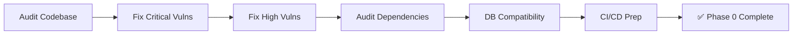

# Phase 0 — Codebase Analysis & Security Hardening

> **Goal**: Audit the existing project for compatibility issues and fix ALL critical + high-severity security vulnerabilities before adding any ERP functionality.  
> **Estimated Duration**: 2–3 days  
> **Prerequisites**: Access to production server, database credentials, GitHub repo admin  
> **Branch**: `feature/phase-0-security-hardening`

---

## Table of Contents

1. [Phase Overview](#1-phase-overview)
2. [Task 0.1 — Environment & Architecture Audit](#task-01--environment--architecture-audit)
3. [Task 0.2 — Critical Security Fixes (🔴)](#task-02--critical-security-fixes-)
4. [Task 0.3 — High Severity Security Fixes (🟠)](#task-03--high-severity-security-fixes-)
5. [Task 0.4 — Dependency Audit & Updates](#task-04--dependency-audit--updates)
6. [Task 0.5 — Database Schema Compatibility Check](#task-05--database-schema-compatibility-check)
7. [Task 0.6 — CI/CD Pipeline Preparation](#task-06--cicd-pipeline-preparation)
8. [Verification Checklist](#verification-checklist)
9. [Deliverables](#deliverables)

---

## 1. Phase Overview



### Why This Phase Exists

The existing codebase has **3 critical** and **4 high-severity** security vulnerabilities identified in the [SECURITY-AUDIT.md](file:///media/thulana/Projects/Projects/Clients/Titec-Automation-website-m3-first/.AI/SECURITY-AUDIT.md). Building an ERP module (handling invoices, financials, client data) on top of an insecure foundation is unacceptable. Phase 0 remediates all blocking issues first.

---

## Task 0.1 — Environment & Architecture Audit

> **Effort**: ~2 hours  
> **Output**: Compatibility report added to this document

### 0.1.1 — Verify cPanel Hosting Constraints

- [ ] **Node.js version**: Confirm cPanel provides Node.js 20+ (needed for Next.js 16). Check via SSH:
  ```bash
  /opt/cpanel/ea-nodejs20/bin/node --version
  ```
- [ ] **PHP version**: Confirm PHP 8.2+ is available:
  ```bash
  php -v
  ```
- [ ] **MySQL version**: Confirm MySQL 8.0+ or MariaDB 10.5+ (needed for UUID functions and JSON operations):
  ```bash
  mysql -V
  ```
- [ ] **Disk space**: Check available disk space for the new `frontend-erp` static build (typically ~50-100MB):
  ```bash
  df -h /home/<cpanel-user>/
  ```
- [ ] **Subdomain support**: Verify that the cPanel plan supports adding subdomains (`erp.titecautomation.lk`). Check:
  - cPanel → Domains → Subdomains
  - DNS A record pointing to the same server IP
- [ ] **SSL**: Verify AutoSSL or Let's Encrypt will cover the new subdomain

### 0.1.2 — Verify Existing Production State

- [ ] **Test current deployment**: Visit `titecautomation.lk` and confirm everything works
- [ ] **Test admin panel**: Login to `/admin` and verify all CRUD operations
- [ ] **Check running processes**:
  ```bash
  ps aux | grep node
  ps aux | grep php
  ```
- [ ] **Check Laravel storage link**:
  ```bash
  ls -la public/storage
  ```
- [ ] **Check Laravel queue worker**:
  ```bash
  ps aux | grep "queue:work"
  ```

### 0.1.3 — Document Current API Surface

- [ ] List all current API endpoints and their auth requirements (cross-reference with [API-REFERENCE.md](file:///media/thulana/Projects/Projects/Clients/Titec-Automation-website-m3-first/.AI/API-REFERENCE.md))
- [ ] Identify any undocumented endpoints
- [ ] Note any endpoints that both `frontend-next` and `frontend-erp` will need to share

---

## Task 0.2 — Critical Security Fixes (🔴)

> **Effort**: ~3 hours  
> **Impact**: Prevents any authenticated user from controlling the entire admin panel

### 🔴 Fix 1: Upgrade Admin Role Authorization Middleware

**Current State**: Routes use only `auth:sanctum` — any authenticated user (including customers) can access admin endpoints. There IS an `admin` middleware in `api.php` (line 36), but we need to verify it exists and works correctly.

**Files to Modify**:
- `backend-laravel/app/Http/Middleware/EnsureUserIsAdmin.php` (verify/create)
- `backend-laravel/bootstrap/app.php` (register middleware alias)
- `backend-laravel/routes/api.php` (verify middleware is applied)

**Steps**:

1. **Verify the `admin` middleware exists** — The routes file references `middleware('admin')`, so check if the middleware class exists:
   ```bash
   find backend-laravel/app/Http/Middleware -name "*.php" | head -20
   ```

2. **If it doesn't exist, create it**:
   ```php
   // app/Http/Middleware/EnsureUserIsAdmin.php
   <?php
   namespace App\Http\Middleware;

   use Closure;
   use Illuminate\Http\Request;
   use Symfony\Component\HttpFoundation\Response;

   class EnsureUserIsAdmin
   {
       public function handle(Request $request, Closure $next): Response
       {
           if (!$request->user() || $request->user()->role !== 'admin') {
               return response()->json(['message' => 'Forbidden. Admin access required.'], 403);
           }
           return $next($request);
       }
   }
   ```

3. **Register the middleware alias** in `bootstrap/app.php`:
   ```php
   ->withMiddleware(function (Middleware $middleware) {
       $middleware->alias([
           'admin' => \App\Http\Middleware\EnsureUserIsAdmin::class,
       ]);
   })
   ```

4. **Verify all admin routes are within the `middleware('admin')` group** — Currently they are (lines 36-71 of `api.php`). Double-check no admin routes have leaked outside.

5. **Test**:
   - Login as customer → try `POST /api/products` → expect `403 Forbidden`
   - Login as admin → try `POST /api/products` → expect `200/201`

---

### 🔴 Fix 2: Lock Down Registration Endpoint

**Current State**: `POST /api/register` accepts a `role` field from user input, allowing anyone to register as `admin`.

**File**: `backend-laravel/app/Http/Controllers/AuthController.php`

**Steps**:

1. **Remove `role` from user-controllable input**:
   ```php
   // BEFORE (vulnerable)
   'role' => $request->role ?? 'customer',

   // AFTER (fixed)
   'role' => 'customer', // Always default to customer
   ```

2. **Add rate limiting** to the registration endpoint in `routes/api.php`:
   ```php
   Route::middleware('throttle:5,1')->group(function () {
       Route::post('/register', [AuthController::class, 'register']);
       Route::post('/login', [AuthController::class, 'login']);
   });
   ```

3. **Consider disabling public registration entirely** if it's not needed for the public website. The admin can create user accounts through the ERP. Check with stakeholder:
   - Is customer registration used on the public website?
   - Can quotation requests work without registration? (Currently: yes, they work for guests)

4. **Test**:
   - Try `POST /api/register` with `{"role": "admin"}` → verify role is still `customer`
   - Try 6+ rapid registrations → expect `429 Too Many Requests`

---

### 🔴 Fix 3: Path Traversal via `deleted_images`

**Current State**: `deleted_images` array from user input is passed directly to `File::delete(public_path($delImg))` — allows deleting any file on the server.

**Files**:
- `backend-laravel/app/Http/Controllers/ProductController.php` (lines ~180-192)
- `backend-laravel/app/Http/Controllers/ProjectController.php` (lines ~144-156)

**Steps**:

1. **Create a reusable helper** for safe file deletion:
   ```php
   // app/Helpers/FileHelper.php
   <?php
   namespace App\Helpers;

   use Illuminate\Support\Facades\File;

   class FileHelper
   {
       /**
        * Safely delete a file, ensuring it's within an allowed directory.
        *
        * @param string $filePath The relative file path from public/
        * @param array $allowedDirs Allowed directory prefixes (e.g., ['storage/products/', 'storage/projects/'])
        * @return bool Whether the file was deleted
        */
       public static function safeDelete(string $filePath, array $allowedDirs): bool
       {
           $realPath = realpath(public_path($filePath));
           if (!$realPath) {
               return false;
           }

           foreach ($allowedDirs as $dir) {
               $allowedPath = realpath(public_path($dir));
               if ($allowedPath && str_starts_with($realPath, $allowedPath)) {
                   File::delete($realPath);
                   return true;
               }
           }

           return false; // Path not in any allowed directory
       }
   }
   ```

2. **Update ProductController**:
   ```php
   // Replace raw File::delete with:
   use App\Helpers\FileHelper;

   foreach ($deletedImages as $delImg) {
       FileHelper::safeDelete($delImg, ['storage/products']);
   }
   ```

3. **Update ProjectController**:
   ```php
   foreach ($deletedImages as $delImg) {
       FileHelper::safeDelete($delImg, ['storage/projects']);
   }
   ```

4. **Test**:
   - Try `deleted_images: ["../../../.env"]` → file should NOT be deleted
   - Try `deleted_images: ["storage/products/test.jpg"]` → file SHOULD be deleted (if exists)

---

## Task 0.3 — High Severity Security Fixes (🟠)

> **Effort**: ~3 hours

### 🟠 Fix 4: Block SVG/XML File Uploads (Stored XSS Prevention)

**File**: `backend-laravel/app/Http/Controllers/BrandController.php`

**Steps**:

1. **Remove `svg` and `xml` from allowed file extensions** in brand logo upload validation:
   ```php
   // BEFORE
   'logo' => 'image|mimes:jpeg,png,gif,webp,svg,xml|max:2048'

   // AFTER
   'logo' => 'image|mimes:jpeg,png,gif,webp|max:2048'
   ```

2. **Check all other controllers** for SVG acceptance:
   ```bash
   grep -rn "svg\|xml" backend-laravel/app/Http/Controllers/ --include="*.php"
   ```

3. **If SVG logos are needed** (some brand logos are SVGs), sanitize before storing:
   - Option A: Convert SVG to PNG on upload using Imagick/GD
   - Option B: Strip all `<script>`, `onload=`, `onerror=` etc. from SVGs using a library like `enshrined/svg-sanitize`

---

### 🟠 Fix 5: Generate Random Filenames for Uploads

**Files**: All controllers that handle file uploads:
- `ProductController.php`
- `ProjectController.php`
- `BrandController.php`
- `ServiceController.php`
- `QuotationRequestController.php`

**Steps**:

1. **Create a standardized upload helper**:
   ```php
   // app/Helpers/FileHelper.php (add to existing)
   public static function generateSafeFilename(\Illuminate\Http\UploadedFile $file): string
   {
       return time() . '_' . \Illuminate\Support\Str::random(16) . '.' . $file->getClientOriginalExtension();
   }
   ```

2. **Replace all instances** of:
   ```php
   $filename = time() . '_' . $file->getClientOriginalName();
   ```
   With:
   ```php
   $filename = FileHelper::generateSafeFilename($file);
   ```

3. **Global search** to ensure no instances are missed:
   ```bash
   grep -rn "getClientOriginalName" backend-laravel/app/ --include="*.php"
   ```

---

### 🟠 Fix 6: Fix Admin Product Listing Bypass

**File**: `backend-laravel/app/Http/Controllers/ProductController.php`

**Steps**:

1. **Replace the `?admin=true` query param check** with proper auth check:
   ```php
   // BEFORE (anyone can use ?admin=true)
   if (!$request->input('admin', false)) {
       $query->where('on_store', true);
   }

   // AFTER (only authenticated admins see hidden products)
   if (!($request->user() && $request->user()->role === 'admin')) {
       $query->where('on_store', true);
   }
   ```

2. **Update the frontend admin products page** — it currently sends `?admin=true`. Change it to rely on the bearer token for admin detection (the backend now checks auth, not the query param).

3. **Frontend change** (`services/productService.ts`):
   ```typescript
   // Remove the admin=true query param — backend now detects admin via auth token
   // The Axios interceptor already attaches the Bearer token
   ```

---

### 🟠 Fix 7: Remove Internal Error Messages from API Responses

**Files**: All controllers

**Steps**:

1. **Global find** all instances of `$e->getMessage()` being returned in responses:
   ```bash
   grep -rn 'getMessage()' backend-laravel/app/Http/Controllers/ --include="*.php"
   ```

2. **Replace each instance** with generic messages + internal logging:
   ```php
   // BEFORE
   return response()->json([
       'message' => 'Failed to create product.',
       'error' => $e->getMessage()
   ], 500);

   // AFTER
   \Log::error('Failed to create product', [
       'error' => $e->getMessage(),
       'trace' => $e->getTraceAsString(),
       'user_id' => auth()->id(),
   ]);
   return response()->json([
       'message' => 'An unexpected error occurred. Please try again.'
   ], 500);
   ```

3. **Remove the custom debug log file** in `QuotationRequestController.php`:
   ```php
   // DELETE this line:
   file_put_contents(storage_path('logs/reply_debug.log'), ...);
   // REPLACE with:
   \Log::error('Quotation reply error', ['exception' => $e]);
   ```

---

## Task 0.4 — Dependency Audit & Updates

> **Effort**: ~1 hour

### 0.4.1 — Backend (Laravel)

- [ ] Check for security advisories:
  ```bash
  cd backend-laravel
  composer audit
  ```
- [ ] Verify `spatie/laravel-permission` compatibility with Laravel 12:
  ```bash
  composer require spatie/laravel-permission --dry-run
  ```
  The package will be installed in Phase 1, but verify compatibility now.
- [ ] Check PHP extension availability on cPanel for Dexie sync (IndexedDB is frontend-only, no PHP changes needed)

### 0.4.2 — Frontend (Next.js)

- [ ] Check for vulnerabilities:
  ```bash
  cd frontend-next
  npm audit
  ```
- [ ] Verify Next.js 16 supports `output: 'export'` for the ERP frontend:
  ```bash
  npx next info
  ```
- [ ] Check that `dexie` and `uuid` packages are compatible with React 19

### 0.4.3 — New Dependencies to Pre-validate

| Package | Purpose | Validate |
|---------|---------|----------|
| `spatie/laravel-permission` | RBAC for Laravel | `composer require --dry-run` |
| `dexie` | IndexedDB wrapper for offline | `npm info dexie` |
| `uuid` | Client-side UUID v4 | `npm info uuid` |

---

## Task 0.5 — Database Schema Compatibility Check

> **Effort**: ~1 hour

### 0.5.1 — Current Schema Review

- [ ] **Export current schema** for reference:
  ```bash
  php artisan schema:dump
  ```
  Or manually:
  ```bash
  mysqldump -u <user> -p --no-data <database> > schema_dump.sql
  ```

- [ ] **Verify the `products` table** has columns that ERP will depend on:
  - `stock` (integer) — needed for POS stock deduction
  - `stock_status` (string) — needed for status updates
  - `price` (decimal) — needed for invoice calculations
  - `brand_id` (foreign key) — needed for product categorization

- [ ] **Check for any orphaned foreign keys** or inconsistencies:
  ```sql
  -- Check for products with non-existent brand_id
  SELECT p.id, p.name, p.brand_id
  FROM products p
  LEFT JOIN brands b ON p.brand_id = b.id
  WHERE p.brand_id IS NOT NULL AND b.id IS NULL;
  ```

### 0.5.2 — Plan New Tables (Preview)

Document the new tables that Phase 1 & 2 will need, verify no naming conflicts:

| New Table | Conflicts With | Status |
|-----------|---------------|--------|
| `roles` | None (Spatie will create) | ✅ Safe |
| `permissions` | None (Spatie will create) | ✅ Safe |
| `model_has_roles` | None (Spatie will create) | ✅ Safe |
| `model_has_permissions` | None (Spatie will create) | ✅ Safe |
| `role_has_permissions` | None (Spatie will create) | ✅ Safe |
| `clients` | None | ✅ Safe |
| `invoices` | None | ✅ Safe |
| `invoice_items` | None | ✅ Safe |
| `installations` | None | ✅ Safe |
| `service_logs` | None | ✅ Safe |

### 0.5.3 — Check `users.role` Column Migration Path

The current `users` table has a simple `role` column (`admin` | `customer`). When Spatie is installed:
- The `role` column will be replaced by the Spatie `roles` relationship
- Existing `admin` users need to be migrated to the `Super Admin` Spatie role
- Existing `customer` users remain as-is (no Spatie role needed)

Create a migration plan:
```php
// Migration: migrate_user_roles_to_spatie
// 1. Create Spatie roles: Super Admin, Content Editor, Sales, Technician, Manager, Accountant, Store Keeper
// 2. Assign existing admin users → Super Admin role
// 3. Keep the `role` column temporarily for backward compatibility
// 4. Update AuthController to use Spatie roles
// 5. Remove `role` column in a future cleanup migration
```

---

## Task 0.6 — CI/CD Pipeline Preparation

> **Effort**: ~1 hour

### 0.6.1 — Document Current Workflow

Review the existing [deploy.yml](file:///media/thulana/Projects/Projects/Clients/Titec-Automation-website-m3-first/.github/workflows/deploy.yml):
- Single job that builds both frontend and backend
- Deploys everything via SSH/SCP to cPanel
- Uses Passenger restart (`touch tmp/restart.txt`)

### 0.6.2 — Pre-work for Phase 1 CI/CD Changes

- [ ] **Verify GitHub Secrets** are set for the new subdomain:
  - `HOST_IP` (same server)
  - `CPANEL_USER` (same user)
  - `SSH_PRIVATE_KEY` (same key)
  - `REMOTE_PORT` (same port)
  - New: `ERP_SUBDOMAIN_PATH` → e.g., `/home/<user>/erp.titecautomation.lk/`
- [ ] **Create the subdomain directory** on the server:
  ```bash
  mkdir -p /home/<cpanel-user>/erp.titecautomation.lk/public_html/
  ```
- [ ] **Set up DNS** for `erp.titecautomation.lk`:
  - Add A record pointing to the same server IP
  - Wait for propagation
- [ ] **Install SSL** for the subdomain via cPanel AutoSSL

### 0.6.3 — Delete Debug Files

As noted in the security audit, remove ALL debug/test scripts:

```bash
cd backend-laravel
rm -f debug_migration.php debug_output.txt debug_quotations.php \
      migrate_error.txt migrate_error_2.txt migrate_output.txt \
      test-db-connection.php
```

Add to `.gitignore`:
```
debug_*.php
debug_*.txt
migrate_*.txt
test-*.php
```

---

## Verification Checklist

> All items must pass before proceeding to Phase 1.

### Security Verification

| # | Test | Method | Expected Result |
|---|------|--------|-----------------|
| 1 | Customer cannot access admin routes | `POST /api/products` with customer token | `403 Forbidden` |
| 2 | Registration always assigns `customer` role | `POST /api/register` with `{"role":"admin"}` | User created with `role: customer` |
| 3 | Path traversal blocked | `PUT /api/products/1` with `deleted_images: ["../../.env"]` | File NOT deleted, no error |
| 4 | SVG upload blocked | `POST /api/brands` with `.svg` logo | `422 Validation Error` |
| 5 | Error messages sanitized | Trigger a server error | Generic message, no stack trace |
| 6 | Admin-only products query fixed | `GET /api/products?admin=true` (no auth) | Only `on_store=true` products |
| 7 | Rate limiting works | 6 rapid login attempts | `429 Too Many Requests` |

### Environment Verification

| # | Check | Command |
|---|-------|---------|
| 1 | Node.js 20+ on cPanel | `node --version` |
| 2 | PHP 8.2+ on cPanel | `php -v` |
| 3 | MySQL 8.0+ | `mysql -V` |
| 4 | Subdomain DNS resolves | `dig erp.titecautomation.lk` |
| 5 | SSL active on subdomain | `curl -I https://erp.titecautomation.lk` |
| 6 | Debug files removed | `ls debug_* test-* migrate_*` → empty |

### Regression Verification

| # | Test | Expected |
|---|------|----------|
| 1 | Public website loads | ✅ All pages render |
| 2 | Admin login works | ✅ Token received |
| 3 | Admin CRUD works (products, projects, brands, services) | ✅ All operations succeed |
| 4 | Quotation request flow works | ✅ Guest can submit, admin can reply |
| 5 | Contact form works | ✅ Message sent |
| 6 | GitHub Actions deploy succeeds | ✅ No pipeline failures |

---

## Deliverables

| # | Deliverable | Description |
|---|-------------|-------------|
| 1 | Security patches | All 7 critical+high fixes committed and deployed |
| 2 | `FileHelper.php` | Reusable helper for safe file operations |
| 3 | Updated `.gitignore` | Debug file patterns excluded |
| 4 | Environment report | Confirmation of cPanel compatibility for ERP |
| 5 | Subdomain setup | `erp.titecautomation.lk` DNS + SSL configured |
| 6 | Schema dump | Current database schema exported for reference |
| 7 | Dependency validation | Confirmation that all Phase 1/2 packages are compatible |

---

## Post-Phase 0 Decision Gate

> [!IMPORTANT]
> **Do NOT proceed to Phase 1** until:
> 1. All security verification tests pass
> 2. The subdomain is accessible with SSL
> 3. All dependency compatibility is confirmed
> 4. The PR for this phase has been reviewed and merged to `main`

---

*Next Phase: [Phase 1 — Admin Panel Migration & RBAC Setup](./Phase-1-Admin-Migration-RBAC.md)*
