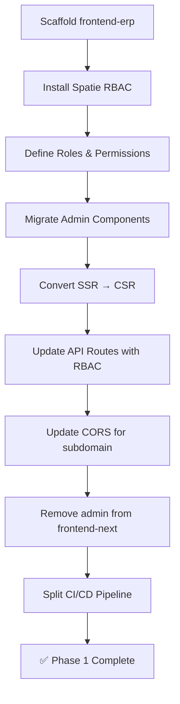
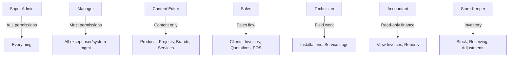

# Phase 1 — Admin Panel Migration & RBAC Setup

> **Goal**: Migrate the existing admin panel from `frontend-next` to a new `frontend-erp` static app, implement Spatie RBAC on the backend, and completely isolate the public website from admin operations.  
> **Estimated Duration**: 5–7 days  
> **Prerequisites**: Phase 0 complete (all security fixes deployed, subdomain configured)  
> **Branch**: `feature/phase-1-admin-migration-rbac`

---

## Table of Contents

1. [Phase Overview](#1-phase-overview)
2. [Task 1.1 — Scaffold `frontend-erp` Application](#task-11--scaffold-frontend-erp-application)
3. [Task 1.2 — Install & Configure Spatie RBAC (Backend)](#task-12--install--configure-spatie-rbac-backend)
4. [Task 1.3 — Migrate Admin Components to ERP Frontend](#task-13--migrate-admin-components-to-erp-frontend)
5. [Task 1.4 — Update Backend API Routes for RBAC](#task-14--update-backend-api-routes-for-rbac)
6. [Task 1.5 — CORS & Auth Configuration Updates](#task-15--cors--auth-configuration-updates)
7. [Task 1.6 — Remove Admin Panel from `frontend-next`](#task-16--remove-admin-panel-from-frontend-next)
8. [Task 1.7 — CI/CD Pipeline Split](#task-17--cicd-pipeline-split)
9. [Verification Checklist](#verification-checklist)
10. [Deliverables](#deliverables)

---

## 1. Phase Overview



### Key Architecture Change

```
BEFORE (Phase 0):                          AFTER (Phase 1):
┌─────────────────────┐                    ┌─────────────────────┐
│    frontend-next    │                    │    frontend-next    │
│  (admin) + (client) │                    │    (client) ONLY    │
└────────┬────────────┘                    └────────┬────────────┘
         │ API                                      │ Public API
┌────────▼────────────┐                    ┌────────▼────────────┐
│   backend-laravel   │                    │   backend-laravel   │
│   auth:sanctum only │                    │   Spatie RBAC       │
└─────────────────────┘                    └────────▲────────────┘
                                                    │ Admin API
                                           ┌────────┴────────────┐
                                           │    frontend-erp     │
                                           │  Static Export (CSR) │
                                           │  erp.titecautomation │
                                           └─────────────────────┘
```

---

## Task 1.1 — Scaffold `frontend-erp` Application

> **Effort**: ~2 hours

### 1.1.1 — Initialize Next.js Project

```bash
# From monorepo root
cd /media/thulana/Projects/Projects/Clients/Titec-Automation-website-m3-first/

# Create the ERP frontend using Next.js 16
npx -y create-next-app@latest frontend-erp \
  --typescript \
  --tailwind \
  --eslint \
  --app \
  --src-dir \
  --no-turbopack \
  --import-alias "@/*"
```

### 1.1.2 — Configure for Static Export

**File**: `frontend-erp/next.config.ts`

```typescript
import type { NextConfig } from 'next';

const nextConfig: NextConfig = {
  output: 'export',           // ← Static HTML export (no Node.js server needed)
  images: {
    unoptimized: true,        // ← cPanel doesn't have Sharp
  },
  // Base path for subdomain deployment
  // Since we're using erp.titecautomation.lk (root), no basePath needed
  // If using titecautomation.lk/erp, uncomment:
  // basePath: '/erp',
  trailingSlash: true,        // ← Better for static hosting
};

export default nextConfig;
```

### 1.1.3 — Install Required Dependencies

```bash
cd frontend-erp
npm install axios clsx tailwind-merge framer-motion lucide-react sonner date-fns
npm install --save-dev @types/node @types/react @types/react-dom
```

### 1.1.4 — Set Up Project Structure

```
frontend-erp/
├── src/
│   ├── app/
│   │   ├── layout.tsx              ← Root layout (dark theme, Geist font)
│   │   ├── page.tsx                ← Login page (default landing)
│   │   ├── globals.css             ← Tailwind + custom styles
│   │   ├── dashboard/
│   │   │   ├── layout.tsx          ← Dashboard layout (sidebar + header)
│   │   │   ├── page.tsx            ← Dashboard home
│   │   │   ├── products/
│   │   │   │   └── page.tsx        ← Product management
│   │   │   ├── projects/
│   │   │   │   └── page.tsx        ← Project management
│   │   │   ├── brands/
│   │   │   │   └── page.tsx        ← Brand management
│   │   │   ├── services/
│   │   │   │   └── page.tsx        ← Service management
│   │   │   ├── quotations/
│   │   │   │   └── page.tsx        ← Quotation management
│   │   │   └── settings/
│   │   │       └── page.tsx        ← User/system settings
│   │   └── not-found.tsx
│   ├── components/
│   │   ├── admin/                   ← Migrated from frontend-next
│   │   │   ├── products-table.tsx
│   │   │   ├── add-product-modal.tsx
│   │   │   ├── edit-product-modal.tsx
│   │   │   ├── projects-table.tsx
│   │   │   ├── add-project-modal.tsx
│   │   │   ├── edit-project-modal.tsx
│   │   │   ├── brands-table.tsx
│   │   │   ├── add-brand-modal.tsx
│   │   │   ├── services-table.tsx
│   │   │   ├── add-service-modal.tsx
│   │   │   ├── quotations-table.tsx
│   │   │   ├── quotation-modal.tsx
│   │   │   ├── quotation-details-modal.tsx
│   │   │   ├── quotation-preview.tsx
│   │   │   ├── product-autocomplete.tsx
│   │   │   └── delete-confirmation-modal.tsx
│   │   ├── ui/                      ← Copied from frontend-next
│   │   │   ├── button.tsx
│   │   │   ├── card.tsx
│   │   │   ├── input.tsx
│   │   │   ├── textarea.tsx
│   │   │   ├── label.tsx
│   │   │   ├── badge.tsx
│   │   │   ├── tabs.tsx
│   │   │   └── sonner.tsx
│   │   └── layout/
│   │       ├── sidebar.tsx          ← Extracted from admin layout
│   │       └── header.tsx           ← Extracted from admin layout
│   ├── context/
│   │   └── AuthContext.tsx          ← Auth context (CSR only, no SSR)
│   ├── services/
│   │   ├── api.ts                   ← Axios instance (CSR only)
│   │   ├── productService.ts
│   │   ├── brandService.ts
│   │   ├── projectService.ts
│   │   ├── serviceService.ts
│   │   ├── quotationService.ts
│   │   ├── dashboardService.ts
│   │   └── authService.ts
│   ├── lib/
│   │   └── utils.ts                 ← cn() utility
│   ├── types/
│   │   ├── index.ts
│   │   └── quotation.ts
│   └── hooks/
│       └── use-local-storage.ts
├── public/
│   └── favicon.ico
├── .env.example
├── next.config.ts
├── package.json
├── tsconfig.json
└── postcss.config.mjs
```

### 1.1.5 — Environment Configuration

**File**: `frontend-erp/.env.example`
```env
NEXT_PUBLIC_BACKEND_URL=https://api.titecautomation.lk
NEXT_PUBLIC_APP_URL=https://erp.titecautomation.lk
```

**File**: `frontend-erp/.env.local` (for development)
```env
NEXT_PUBLIC_BACKEND_URL=http://127.0.0.1:8000
NEXT_PUBLIC_APP_URL=http://localhost:3001
```

### 1.1.6 — Update `package.json` scripts

```json
{
  "scripts": {
    "dev": "next dev -p 3001 --webpack",
    "build": "next build",
    "start": "npx serve out",
    "lint": "eslint"
  }
}
```

> [!NOTE]
> The ERP dev server runs on port **3001** to avoid conflicts with `frontend-next` on port 3000.

---

## Task 1.2 — Install & Configure Spatie RBAC (Backend)

> **Effort**: ~3 hours

### 1.2.1 — Install Spatie Package

```bash
cd backend-laravel
composer require spatie/laravel-permission
php artisan vendor:publish --provider="Spatie\Permission\PermissionServiceProvider"
php artisan migrate
```

This creates 5 tables: `roles`, `permissions`, `model_has_roles`, `model_has_permissions`, `role_has_permissions`.

### 1.2.2 — Configure User Model

**File**: `backend-laravel/app/Models/User.php`

```php
<?php

namespace App\Models;

use Illuminate\Database\Eloquent\Factories\HasFactory;
use Illuminate\Foundation\Auth\User as Authenticatable;
use Illuminate\Notifications\Notifiable;
use Laravel\Sanctum\HasApiTokens;
use Spatie\Permission\Traits\HasRoles;  // ← ADD

class User extends Authenticatable
{
    use HasFactory, Notifiable, HasApiTokens, HasRoles;  // ← ADD HasRoles

    protected $fillable = [
        'name',
        'email',
        'password',
        'role',  // Keep temporarily for backward compatibility
    ];

    // ... rest unchanged
}
```

### 1.2.3 — Define Roles & Permissions

Create a seeder: `php artisan make:seeder RolesAndPermissionsSeeder`

**File**: `backend-laravel/database/seeders/RolesAndPermissionsSeeder.php`

```php
<?php

namespace Database\Seeders;

use Illuminate\Database\Seeder;
use Spatie\Permission\Models\Role;
use Spatie\Permission\Models\Permission;

class RolesAndPermissionsSeeder extends Seeder
{
    public function run(): void
    {
        // Reset cached roles and permissions
        app()[\Spatie\Permission\PermissionRegistrar::class]->forgetCachedPermissions();

        // ═══════════════════════════════════════════════
        // PERMISSIONS — Granular access control
        // ═══════════════════════════════════════════════

        // Content Management (existing admin panel features)
        $contentPermissions = [
            'products.view',
            'products.create',
            'products.edit',
            'products.delete',
            'projects.view',
            'projects.create',
            'projects.edit',
            'projects.delete',
            'brands.view',
            'brands.create',
            'brands.edit',
            'brands.delete',
            'services.view',
            'services.create',
            'services.edit',
            'services.delete',
            'quotations.view',
            'quotations.reply',
            'quotations.create',
            'dashboard.view',
        ];

        // ERP Permissions (Phase 2 — create now, assign later)
        $erpPermissions = [
            // Clients
            'clients.view',
            'clients.create',
            'clients.edit',
            'clients.delete',
            // Invoices / POS
            'invoices.view',
            'invoices.create',
            'invoices.edit',
            'invoices.void',
            // Inventory
            'inventory.view',
            'inventory.adjust',
            'inventory.receive',
            // Installations
            'installations.view',
            'installations.create',
            'installations.edit',
            'installations.update_status',
            // Service History
            'service_logs.view',
            'service_logs.create',
            'service_logs.edit',
            // Reports
            'reports.sales',
            'reports.inventory',
            'reports.warranty',
            // System
            'users.view',
            'users.create',
            'users.edit',
            'users.delete',
            'settings.manage',
        ];

        $allPermissions = array_merge($contentPermissions, $erpPermissions);

        foreach ($allPermissions as $permission) {
            Permission::firstOrCreate(['name' => $permission, 'guard_name' => 'sanctum']);
        }

        // ═══════════════════════════════════════════════
        // ROLES — Role definitions with permission sets
        // ═══════════════════════════════════════════════

        // Super Admin — unrestricted access to everything
        $superAdmin = Role::firstOrCreate(['name' => 'Super Admin', 'guard_name' => 'sanctum']);
        $superAdmin->syncPermissions($allPermissions);

        // Content Editor — manage website content (products, projects, brands, services)
        $contentEditor = Role::firstOrCreate(['name' => 'Content Editor', 'guard_name' => 'sanctum']);
        $contentEditor->syncPermissions([
            'products.view', 'products.create', 'products.edit', 'products.delete',
            'projects.view', 'projects.create', 'projects.edit', 'projects.delete',
            'brands.view', 'brands.create', 'brands.edit', 'brands.delete',
            'services.view', 'services.create', 'services.edit', 'services.delete',
            'dashboard.view',
        ]);

        // Sales — POS, invoicing, client management, quotations
        $sales = Role::firstOrCreate(['name' => 'Sales', 'guard_name' => 'sanctum']);
        $sales->syncPermissions([
            'products.view',
            'brands.view',
            'quotations.view', 'quotations.reply', 'quotations.create',
            'clients.view', 'clients.create', 'clients.edit',
            'invoices.view', 'invoices.create', 'invoices.edit',
            'inventory.view',
            'dashboard.view',
            'reports.sales',
        ]);

        // Technician — installations, service history, field work
        $technician = Role::firstOrCreate(['name' => 'Technician', 'guard_name' => 'sanctum']);
        $technician->syncPermissions([
            'products.view',
            'clients.view',
            'installations.view', 'installations.update_status',
            'service_logs.view', 'service_logs.create', 'service_logs.edit',
        ]);

        // Manager — full ERP access, no user/system management
        $manager = Role::firstOrCreate(['name' => 'Manager', 'guard_name' => 'sanctum']);
        $manager->syncPermissions(array_diff($allPermissions, [
            'users.create', 'users.edit', 'users.delete',
            'settings.manage',
        ]));

        // Accountant — read-only financial access
        $accountant = Role::firstOrCreate(['name' => 'Accountant', 'guard_name' => 'sanctum']);
        $accountant->syncPermissions([
            'invoices.view',
            'clients.view',
            'reports.sales',
            'reports.inventory',
            'reports.warranty',
            'dashboard.view',
        ]);

        // Store Keeper — inventory management
        $storeKeeper = Role::firstOrCreate(['name' => 'Store Keeper', 'guard_name' => 'sanctum']);
        $storeKeeper->syncPermissions([
            'products.view',
            'brands.view',
            'inventory.view', 'inventory.adjust', 'inventory.receive',
            'reports.inventory',
        ]);
    }
}
```

### 1.2.4 — Migrate Existing Admin Users to Spatie Roles

Create a migration: `php artisan make:migration migrate_user_roles_to_spatie`

```php
<?php

use Illuminate\Database\Migrations\Migration;
use Illuminate\Support\Facades\DB;
use Spatie\Permission\Models\Role;
use App\Models\User;

return new class extends Migration
{
    public function up(): void
    {
        // Ensure roles exist (idempotent)
        $superAdmin = Role::firstOrCreate(['name' => 'Super Admin', 'guard_name' => 'sanctum']);

        // Migrate existing admin users to Super Admin role
        $adminUsers = User::where('role', 'admin')->get();
        foreach ($adminUsers as $user) {
            $user->assignRole($superAdmin);
        }
    }

    public function down(): void
    {
        // Revert: remove Spatie roles from users
        $adminUsers = User::role('Super Admin')->get();
        foreach ($adminUsers as $user) {
            $user->removeRole('Super Admin');
        }
    }
};
```

### 1.2.5 — Update AuthController for Spatie

**File**: `backend-laravel/app/Http/Controllers/AuthController.php`

**Changes**:

1. **Login response** — include Spatie roles and permissions:
   ```php
   public function login(Request $request)
   {
       // ... existing validation and auth logic ...

       $token = $user->createToken('auth_token')->plainTextToken;

       return response()->json([
           'access_token' => $token,
           'token_type' => 'Bearer',
           'user' => [
               'id' => $user->id,
               'name' => $user->name,
               'email' => $user->email,
               'roles' => $user->getRoleNames(),              // ← NEW
               'permissions' => $user->getAllPermissions()      // ← NEW
                   ->pluck('name'),
           ],
       ]);
   }
   ```

2. **GET /api/user** — include roles:
   ```php
   Route::get('/user', function (Request $request) {
       $user = $request->user();
       return response()->json([
           'id' => $user->id,
           'name' => $user->name,
           'email' => $user->email,
           'roles' => $user->getRoleNames(),
           'permissions' => $user->getAllPermissions()->pluck('name'),
       ]);
   });
   ```

### 1.2.6 — Roles & Permissions Summary



---

## Task 1.3 — Migrate Admin Components to ERP Frontend

> **Effort**: ~8 hours (largest task)

### 1.3.1 — Migration Strategy: SSR → CSR Conversion

The existing admin components in `frontend-next` use a mix of server-side rendering and client-side data fetching. Since `frontend-erp` uses `output: 'export'` (static HTML), **ALL data fetching must be client-side**.

#### Conversion Rules

| Pattern in `frontend-next` | Convert to in `frontend-erp` |
|---|---|
| Server Component with `async` data fetch | Client Component with `useEffect` + `useState` |
| `fetchFromApi()` (SSR fetch) | Axios call in `useEffect` (CSR) |
| `services/api.ts` (SSR fetch wrapper) | **DELETE** — not needed, only use `lib/api.ts` (Axios) |
| `getServerSideProps` / server-side cookies | `localStorage` token via Axios interceptor |
| Next.js `<Image>` with optimization | Standard `` or `<Image>` with `unoptimized` |

### 1.3.2 — Copy Shared UI Components

These components are purely presentational and can be copied directly:

```bash
# From monorepo root
cp frontend-next/src/components/ui/*.tsx frontend-erp/src/components/ui/
cp frontend-next/src/lib/utils.ts frontend-erp/src/lib/utils.ts
```

**Files to copy (no changes needed)**:
- `components/ui/button.tsx`
- `components/ui/card.tsx`
- `components/ui/input.tsx`
- `components/ui/textarea.tsx`
- `components/ui/label.tsx`
- `components/ui/badge.tsx`
- `components/ui/tabs.tsx`
- `components/ui/sonner.tsx`
- `lib/utils.ts` (cn utility)

### 1.3.3 — Migrate AuthContext (CSR-Only Version)

The existing `AuthContext` uses `localStorage` already (✅ compatible with static export). Key changes needed:

```typescript
// frontend-erp/src/context/AuthContext.tsx

'use client';
import { createContext, useContext, useState, useEffect, ReactNode } from 'react';
import { useRouter, usePathname } from 'next/navigation';
import api from '@/services/api';

interface User {
  id: number;
  name: string;
  email: string;
  roles: string[];          // ← NEW: Spatie roles array
  permissions: string[];    // ← NEW: Spatie permissions array
}

interface AuthContextType {
  user: User | null;
  isLoading: boolean;
  login: (email: string, password: string) => Promise<void>;
  logout: () => void;
  hasRole: (role: string) => boolean;           // ← NEW
  hasPermission: (permission: string) => boolean; // ← NEW
  hasAnyRole: (roles: string[]) => boolean;     // ← NEW
}

// ... implementation with:
// - localStorage persistence
// - Axios interceptor for Bearer token
// - Role/permission checking helpers
// - Auto-redirect to login on 401
// - Route protection based on permissions
```

**Key Differences from `frontend-next` AuthContext**:
1. No SSR safety checks needed (everything is CSR in static export)
2. Added `roles` and `permissions` arrays from Spatie
3. Added `hasRole()`, `hasPermission()`, `hasAnyRole()` helpers
4. Login redirects to `/dashboard` instead of `/admin`
5. Login page is `/` (root) instead of `/admin/login`

### 1.3.4 — Migrate Axios Instance

**File**: `frontend-erp/src/services/api.ts`

```typescript
import axios from 'axios';

const API_BASE_URL = process.env.NEXT_PUBLIC_BACKEND_URL || 'http://127.0.0.1:8000';

const api = axios.create({
  baseURL: `${API_BASE_URL}/api`,
  headers: {
    'Content-Type': 'application/json',
    'Accept': 'application/json',
  },
  withCredentials: true,
});

// Request interceptor — attach Bearer token
api.interceptors.request.use((config) => {
  const userData = localStorage.getItem('erp_user');  // ← Different key from frontend-next
  if (userData) {
    const user = JSON.parse(userData);
    if (user.token) {
      config.headers.Authorization = `Bearer ${user.token}`;
    }
  }
  return config;
});

// Response interceptor — handle 401
api.interceptors.response.use(
  (response) => response,
  (error) => {
    if (error.response?.status === 401) {
      localStorage.removeItem('erp_user');
      if (typeof window !== 'undefined') {
        window.location.href = '/';  // ← Redirect to login
      }
    }
    return Promise.reject(error);
  }
);

export default api;
```

> [!IMPORTANT]
> The localStorage key is `erp_user` (NOT `user`) to avoid conflicts if someone visits both the public site and ERP on the same browser.

### 1.3.5 — Migrate Admin Components (One by One)

For each admin component, the conversion process is:

1. **Copy the file** from `frontend-next/src/components/admin/` to `frontend-erp/src/components/admin/`
2. **Ensure `'use client'` directive** is at the top
3. **Replace any `fetchFromApi` calls** with the Axios-based service calls
4. **Add permission checks** where appropriate
5. **Update import paths** (`@/` prefix maps to `frontend-erp/src/`)

#### Component Migration Checklist

| Component | Source | Changes Required |
|-----------|--------|-----------------|
| `products-table.tsx` | Direct copy | Update imports, add `hasPermission('products.edit')` checks |
| `add-product-modal.tsx` | Direct copy | Update imports |
| `edit-product-modal.tsx` | Direct copy | Update imports |
| `projects-table.tsx` | Direct copy | Update imports, permission checks |
| `add-project-modal.tsx` | Direct copy | Update imports |
| `edit-project-modal.tsx` | Direct copy | Update imports |
| `brands-table.tsx` | Direct copy | Update imports, permission checks |
| `add-brand-modal.tsx` | Direct copy | Update imports |
| `services-table.tsx` | Direct copy | Update imports, permission checks |
| `add-service-modal.tsx` | Direct copy | Update imports |
| `quotations-table.tsx` | Direct copy | Update imports, permission checks |
| `quotation-modal.tsx` | Direct copy | Update imports |
| `quotation-details-modal.tsx` | Direct copy | Update imports |
| `quotation-preview.tsx` | Direct copy | Update imports |
| `product-autocomplete.tsx` | Direct copy | Update imports |
| `delete-confirmation-modal.tsx` | Direct copy | No changes |

#### Example: Permission-Gated Action Buttons

```tsx
// products-table.tsx — Before
<Button onClick={() => handleEdit(product)}>Edit</Button>
<Button onClick={() => handleDelete(product)}>Delete</Button>

// products-table.tsx — After (with RBAC)
const { hasPermission } = useAuth();

{hasPermission('products.edit') && (
  <Button onClick={() => handleEdit(product)}>Edit</Button>
)}
{hasPermission('products.delete') && (
  <Button onClick={() => handleDelete(product)}>Delete</Button>
)}
```

### 1.3.6 — Migrate Service Modules

Copy and adapt all service modules:

```bash
cp frontend-next/src/services/productService.ts frontend-erp/src/services/
cp frontend-next/src/services/brandService.ts frontend-erp/src/services/
cp frontend-next/src/services/projectService.ts frontend-erp/src/services/
cp frontend-next/src/services/serviceService.ts frontend-erp/src/services/
cp frontend-next/src/services/quotationService.ts frontend-erp/src/services/
cp frontend-next/src/services/dashboardService.ts frontend-erp/src/services/
```

**Changes needed**:
- All services should import from `@/services/api` (Axios instance)
- Remove any SSR-specific `fetchFromApi` calls
- Ensure all methods return Promises (they already do with Axios)

### 1.3.7 — Migrate Dashboard Layout (Sidebar + Header)

**Extract sidebar into a standalone component**:

**File**: `frontend-erp/src/components/layout/sidebar.tsx`

```typescript
// Extracted from frontend-next/src/app/(admin)/admin/layout.tsx
// Changes:
// 1. Routes change: /admin/products → /dashboard/products
// 2. Add permission-based menu filtering
// 3. Add role badge next to user name
// 4. Title: "TiTEC Admin" → "TiTEC ERP"

const menuItems = [
  { name: 'Dashboard', icon: LayoutDashboard, href: '/dashboard', permission: 'dashboard.view' },
  { name: 'Quotation Requests', icon: FileText, href: '/dashboard/quotations', permission: 'quotations.view' },
  { name: 'Projects', icon: FolderPlus, href: '/dashboard/projects', permission: 'projects.view' },
  { name: 'Products', icon: Package, href: '/dashboard/products', permission: 'products.view' },
  { name: 'Brands', icon: LayoutGrid, href: '/dashboard/brands', permission: 'brands.view' },
  { name: 'Services', icon: Wrench, href: '/dashboard/services', permission: 'services.view' },
  // Phase 2 items (hidden until features are built):
  // { name: 'Clients', icon: Users, href: '/dashboard/clients', permission: 'clients.view' },
  // { name: 'POS / Billing', icon: Receipt, href: '/dashboard/pos', permission: 'invoices.create' },
  // { name: 'Installations', icon: HardHat, href: '/dashboard/installations', permission: 'installations.view' },
  // { name: 'Service History', icon: ClipboardList, href: '/dashboard/service-logs', permission: 'service_logs.view' },
  // { name: 'Reports', icon: BarChart, href: '/dashboard/reports', permission: 'reports.sales' },
  { name: 'Settings', icon: Settings, href: '/dashboard/settings', permission: 'settings.manage' },
];

// Filter menu items based on user permissions
const visibleItems = menuItems.filter(item => hasPermission(item.permission));
```

### 1.3.8 — Page Conversion (SSR → CSR)

**Example: Dashboard Page**

```typescript
// frontend-next (BEFORE — SSR with server fetch):
// src/app/(admin)/admin/page.tsx
export default async function AdminDashboard() {
  const stats = await fetchFromApi('/dashboard/stats');
  return <DashboardView stats={stats} />;
}

// frontend-erp (AFTER — CSR with useEffect):
// src/app/dashboard/page.tsx
'use client';
import { useState, useEffect } from 'react';
import { getDashboardStats } from '@/services/dashboardService';

export default function DashboardPage() {
  const [stats, setStats] = useState(null);
  const [loading, setLoading] = useState(true);

  useEffect(() => {
    getDashboardStats()
      .then(data => setStats(data))
      .catch(console.error)
      .finally(() => setLoading(false));
  }, []);

  if (loading) return <DashboardSkeleton />;
  return <DashboardView stats={stats} />;
}
```

**Apply this pattern to ALL pages**:

| Page | Route (old) | Route (new) |
|------|-------------|-------------|
| Dashboard | `/admin` | `/dashboard` |
| Products | `/admin/products` | `/dashboard/products` |
| Projects | `/admin/projects` | `/dashboard/projects` |
| Brands | `/admin/brands` | `/dashboard/brands` |
| Services | `/admin/services` | `/dashboard/services` |
| Quotations | `/admin/quotations` | `/dashboard/quotations` |
| Settings | `/admin/settings` | `/dashboard/settings` |
| Login | `/admin/login` | `/` (root) |

---

## Task 1.4 — Update Backend API Routes for RBAC

> **Effort**: ~2 hours

### 1.4.1 — Replace Custom Admin Middleware with Spatie

**File**: `backend-laravel/routes/api.php`

Replace the current `middleware('admin')` with Spatie's permission middleware:

```php
<?php

use Illuminate\Http\Request;
use Illuminate\Support\Facades\Route;
use App\Http\Controllers\AuthController;
use App\Http\Controllers\ProjectController;
use App\Http\Controllers\ProductController;
use App\Http\Controllers\BrandController;
use App\Http\Controllers\ServiceController;

// ═══════════════════════════════════════════════
// PUBLIC ROUTES (no authentication required)
// ═══════════════════════════════════════════════

Route::middleware('throttle:5,1')->group(function () {
    Route::post('/register', [AuthController::class, 'register']);
    Route::post('/login', [AuthController::class, 'login']);
});

Route::get('/projects', [ProjectController::class, 'index']);
Route::get('/projects/{project}', [ProjectController::class, 'show']);
Route::get('/products/{id}', [ProductController::class, 'show']);
Route::get('/products', [ProductController::class, 'index']);
Route::get('/brands', [BrandController::class, 'index']);
Route::get('/brands/{brand}', [BrandController::class, 'show']);
Route::get('/services', [ServiceController::class, 'index']);
Route::get('/services/{slug}', [ServiceController::class, 'show']);

Route::middleware('throttle:3,1')->group(function () {
    Route::post('/quotation-requests', [App\Http\Controllers\QuotationRequestController::class, 'store']);
    Route::post('/contact', [App\Http\Controllers\ContactController::class, 'store']);
});

// ═══════════════════════════════════════════════
// AUTHENTICATED ROUTES
// ═══════════════════════════════════════════════

Route::middleware('auth:sanctum')->group(function () {
    Route::post('/logout', [AuthController::class, 'logout']);
    Route::get('/user', function (Request $request) {
        $user = $request->user();
        return response()->json([
            'id' => $user->id,
            'name' => $user->name,
            'email' => $user->email,
            'roles' => $user->getRoleNames(),
            'permissions' => $user->getAllPermissions()->pluck('name'),
        ]);
    });

    // ── Content Management ──────────────────────
    Route::middleware('permission:products.create')->post('/products', [ProductController::class, 'store']);
    Route::middleware('permission:products.edit')->put('/products/{product}', [ProductController::class, 'update']);
    Route::middleware('permission:products.delete')->delete('/products/{product}', [ProductController::class, 'destroy']);

    Route::middleware('permission:projects.create')->post('/projects', [ProjectController::class, 'store']);
    Route::middleware('permission:projects.edit')->put('/projects/{project}', [ProjectController::class, 'update']);
    Route::middleware('permission:projects.delete')->delete('/projects/{project}', [ProjectController::class, 'destroy']);

    Route::middleware('permission:brands.create')->post('/brands', [BrandController::class, 'store']);
    Route::middleware('permission:brands.edit')->put('/brands/{brand}', [BrandController::class, 'update']);
    Route::middleware('permission:brands.delete')->delete('/brands/{brand}', [BrandController::class, 'destroy']);

    Route::middleware('permission:services.create')->post('/services', [ServiceController::class, 'store']);
    Route::middleware('permission:services.edit')->put('/services/{service}', [ServiceController::class, 'update']);
    Route::middleware('permission:services.delete')->delete('/services/{service}', [ServiceController::class, 'destroy']);

    // ── Quotations ──────────────────────────────
    Route::middleware('permission:quotations.view')->group(function () {
        Route::get('/quotations', [App\Http\Controllers\QuotationController::class, 'index']);
        Route::get('/quotations/{quotation}', [App\Http\Controllers\QuotationController::class, 'show']);
        Route::get('/quotation-requests', [App\Http\Controllers\QuotationRequestController::class, 'index']);
        Route::get('/quotation-requests/{id}/download', [App\Http\Controllers\QuotationRequestController::class, 'download']);
    });
    Route::middleware('permission:quotations.reply')->group(function () {
        Route::post('/quotation-requests/{id}/reply', [App\Http\Controllers\QuotationRequestController::class, 'reply']);
        Route::post('/quotation-requests/direct', [App\Http\Controllers\QuotationRequestController::class, 'sendDirectQuote']);
        Route::post('/quotations/preview', [App\Http\Controllers\QuotationController::class, 'preview']);
        Route::put('/quotations/{quotation}', [App\Http\Controllers\QuotationController::class, 'update']);
    });

    // ── Dashboard ───────────────────────────────
    Route::middleware('permission:dashboard.view')->get('/dashboard/stats', [App\Http\Controllers\DashboardController::class, 'index']);
});
```

### 1.4.2 — Register Spatie Middleware

**File**: `backend-laravel/bootstrap/app.php`

```php
->withMiddleware(function (Middleware $middleware) {
    $middleware->alias([
        'role' => \Spatie\Permission\Middleware\RoleMiddleware::class,
        'permission' => \Spatie\Permission\Middleware\PermissionMiddleware::class,
        'role_or_permission' => \Spatie\Permission\Middleware\RoleOrPermissionMiddleware::class,
    ]);
})
```

---

## Task 1.5 — CORS & Auth Configuration Updates

> **Effort**: ~30 minutes

### 1.5.1 — Update CORS Configuration

**File**: `backend-laravel/config/cors.php`

Add the ERP subdomain to allowed origins:

```php
'allowed_origins' => [
    'http://localhost:3000',        // frontend-next dev
    'http://localhost:3001',        // frontend-erp dev
    'http://127.0.0.1:3000',
    'http://127.0.0.1:3001',
    'https://localhost:3000',
    'https://localhost:3001',
    'https://127.0.0.1:3000',
    'https://127.0.0.1:3001',
    'https://titecautomation.lk',          // Production website
    'https://erp.titecautomation.lk',      // ← NEW: Production ERP
],
```

### 1.5.2 — Update Sanctum Configuration

**File**: `backend-laravel/config/sanctum.php`

```php
'stateful' => explode(',', env('SANCTUM_STATEFUL_DOMAINS', implode(',', [
    'localhost:3000',
    'localhost:3001',               // ← NEW
    '127.0.0.1:3000',
    '127.0.0.1:3001',              // ← NEW
    'titecautomation.lk',
    'erp.titecautomation.lk',      // ← NEW
]))),
```

### 1.5.3 — Update `.env` on Production

Add to the production `.env`:
```env
SANCTUM_STATEFUL_DOMAINS=titecautomation.lk,erp.titecautomation.lk
```

---

## Task 1.6 — Remove Admin Panel from `frontend-next`

> **Effort**: ~1 hour

### 1.6.1 — Delete Admin Route Group

```bash
cd frontend-next

# Remove admin pages
rm -rf src/app/\(admin\)/

# Remove admin components
rm -rf src/components/admin/
```

### 1.6.2 — Clean Up Unused Imports & Services

- [ ] Remove `dashboardService.ts` from `frontend-next/src/services/` (only used by admin)
- [ ] Remove admin-specific types from `types/`
- [ ] Keep `AuthContext.tsx` — it's still used for customer authentication (if any)
- [ ] Keep `quotationService.ts` — the public store page uses `createQuotationRequest()`
- [ ] Remove admin menu items from any shared navigation

### 1.6.3 — Simplify AuthContext (Customer-Only)

Remove `isAdmin` checks and admin redirect logic since admin is no longer in this app:

```typescript
// Remove:
const isAdmin = user?.role === 'admin';
// Remove admin redirect logic
// Keep only customer-related auth features
```

### 1.6.4 — Add Redirect for Old Admin URLs

Add a simple redirect so anyone visiting the old `/admin` URL gets pointed to the ERP:

**File**: `frontend-next/src/app/(client)/admin/page.tsx` (or use `next.config.js` redirects)

```javascript
// next.config.js
module.exports = {
  async redirects() {
    return [
      {
        source: '/admin/:path*',
        destination: 'https://erp.titecautomation.lk/:path*',
        permanent: true,
      },
    ];
  },
};
```

---

## Task 1.7 — CI/CD Pipeline Split

> **Effort**: ~2 hours

### 1.7.1 — New Deployment Workflow

**File**: `.github/workflows/deploy.yml` — Complete rewrite with 3 independent jobs + staging

```yaml
name: Deploy (Path-Filtered)

on:
  push:
    branches: [main]
  pull_request:
    branches: [main]

jobs:
  # ═══════════════════════════════════════════════
  # Step 0: Detect which paths changed
  # ═══════════════════════════════════════════════
  changes:
    runs-on: ubuntu-latest
    outputs:
      frontend-next: ${{ steps.filter.outputs.frontend-next }}
      frontend-erp: ${{ steps.filter.outputs.frontend-erp }}
      backend: ${{ steps.filter.outputs.backend }}
    steps:
      - uses: actions/checkout@v4
      - uses: dorny/paths-filter@v3
        id: filter
        with:
          filters: |
            frontend-next:
              - 'frontend-next/**'
            frontend-erp:
              - 'frontend-erp/**'
            backend:
              - 'backend-laravel/**'

  # ═══════════════════════════════════════════════
  # Job 1: Deploy Main Website (SSR Next.js)
  # ═══════════════════════════════════════════════
  deploy-main-web:
    needs: changes
    if: needs.changes.outputs.frontend-next == 'true' && github.event_name == 'push'
    runs-on: ubuntu-latest
    steps:
      - uses: actions/checkout@v4

      - name: ⚙️ Setup Node
        uses: actions/setup-node@v4
        with:
          node-version: '20'

      - name: 🔨 Build Frontend
        env:
          NEXT_PUBLIC_BACKEND_URL: ${{ secrets.NEXT_PUBLIC_BACKEND_URL }}
        run: |
          cd frontend-next
          npm install
          npm run build
          rm -rf node_modules

      - name: 📦 Archive Frontend
        run: tar -czf frontend-next.tar.gz frontend-next/

      - name: 🚀 Deploy Frontend
        uses: appleboy/scp-action@master
        with:
          host: ${{ secrets.HOST_IP }}
          username: ${{ secrets.CPANEL_USER }}
          key: ${{ secrets.SSH_PRIVATE_KEY }}
          port: ${{ secrets.REMOTE_PORT }}
          source: "frontend-next.tar.gz"
          target: "/home/${{ secrets.CPANEL_USER }}/repositories/titec_project/"

      - name: 🔄 Extract & Restart
        uses: appleboy/ssh-action@master
        with:
          host: ${{ secrets.HOST_IP }}
          username: ${{ secrets.CPANEL_USER }}
          key: ${{ secrets.SSH_PRIVATE_KEY }}
          port: ${{ secrets.REMOTE_PORT }}
          script: |
            cd /home/${{ secrets.CPANEL_USER }}/repositories/titec_project/
            pkill -u ${{ secrets.CPANEL_USER }} node || true
            rm -rf frontend-next/.next
            tar -xzf frontend-next.tar.gz
            rm frontend-next.tar.gz
            cd frontend-next
            export PATH="/opt/cpanel/ea-nodejs20/bin:$PATH"
            npm install --production
            mkdir -p tmp && touch tmp/restart.txt

  # ═══════════════════════════════════════════════
  # Job 2: Deploy ERP (Static Export)
  # ═══════════════════════════════════════════════
  deploy-erp:
    needs: changes
    if: needs.changes.outputs.frontend-erp == 'true' && github.event_name == 'push'
    runs-on: ubuntu-latest
    steps:
      - uses: actions/checkout@v4

      - name: ⚙️ Setup Node
        uses: actions/setup-node@v4
        with:
          node-version: '20'

      - name: 🔨 Build ERP (Static Export)
        env:
          NEXT_PUBLIC_BACKEND_URL: ${{ secrets.NEXT_PUBLIC_BACKEND_URL }}
          NEXT_PUBLIC_APP_URL: ${{ secrets.ERP_APP_URL }}
        run: |
          cd frontend-erp
          npm install
          npm run build
          # Static export outputs to 'out/' directory

      - name: 📦 Archive ERP
        run: tar -czf frontend-erp-out.tar.gz -C frontend-erp/out .

      - name: 🚀 Deploy ERP Static Files
        uses: appleboy/scp-action@master
        with:
          host: ${{ secrets.HOST_IP }}
          username: ${{ secrets.CPANEL_USER }}
          key: ${{ secrets.SSH_PRIVATE_KEY }}
          port: ${{ secrets.REMOTE_PORT }}
          source: "frontend-erp-out.tar.gz"
          target: "/home/${{ secrets.CPANEL_USER }}/erp.titecautomation.lk/"

      - name: 🔄 Extract Static Files
        uses: appleboy/ssh-action@master
        with:
          host: ${{ secrets.HOST_IP }}
          username: ${{ secrets.CPANEL_USER }}
          key: ${{ secrets.SSH_PRIVATE_KEY }}
          port: ${{ secrets.REMOTE_PORT }}
          script: |
            cd /home/${{ secrets.CPANEL_USER }}/erp.titecautomation.lk/
            rm -rf public_html/*
            tar -xzf frontend-erp-out.tar.gz -C public_html/
            rm frontend-erp-out.tar.gz

  # ═══════════════════════════════════════════════
  # Job 3: Deploy Backend (Laravel)
  # ═══════════════════════════════════════════════
  deploy-backend:
    needs: changes
    if: needs.changes.outputs.backend == 'true' && github.event_name == 'push'
    runs-on: ubuntu-latest
    steps:
      - uses: actions/checkout@v4

      - name: ⚙️ Setup PHP
        uses: shivammathur/setup-php@v2
        with:
          php-version: '8.2'
          extensions: mbstring, xml, ctype, iconv, intl, pdo_mysql, dom, fileinfo

      - name: 🔨 Build Backend
        run: |
          cd backend-laravel
          composer install --no-dev --optimize-autoloader --prefer-dist --ignore-platform-reqs

      - name: 📦 Archive Backend
        run: |
          tar -czf backend-laravel.tar.gz \
            --exclude='backend-laravel/.env' \
            --exclude='backend-laravel/storage/logs/*' \
            backend-laravel/

      - name: 🚀 Deploy Backend
        uses: appleboy/scp-action@master
        with:
          host: ${{ secrets.HOST_IP }}
          username: ${{ secrets.CPANEL_USER }}
          key: ${{ secrets.SSH_PRIVATE_KEY }}
          port: ${{ secrets.REMOTE_PORT }}
          source: "backend-laravel.tar.gz"
          target: "/home/${{ secrets.CPANEL_USER }}/repositories/titec_project/"

      - name: 🔄 Extract & Migrate
        uses: appleboy/ssh-action@master
        with:
          host: ${{ secrets.HOST_IP }}
          username: ${{ secrets.CPANEL_USER }}
          key: ${{ secrets.SSH_PRIVATE_KEY }}
          port: ${{ secrets.REMOTE_PORT }}
          script: |
            cd /home/${{ secrets.CPANEL_USER }}/repositories/titec_project/
            tar -xzf backend-laravel.tar.gz
            rm backend-laravel.tar.gz
            cd backend-laravel
            php artisan migrate --force
            php artisan config:clear
            php artisan cache:clear
            php artisan config:cache
            php artisan permission:cache-reset

  # ═══════════════════════════════════════════════
  # Staging Deploys (PR only)
  # ═══════════════════════════════════════════════
  staging-preview:
    if: github.event_name == 'pull_request'
    runs-on: ubuntu-latest
    steps:
      - uses: actions/checkout@v4
      - name: 🏗️ Build Check (Frontend)
        run: |
          cd frontend-next && npm install && npm run build
      - name: 🏗️ Build Check (ERP)
        run: |
          cd frontend-erp && npm install && npm run build
        continue-on-error: true
      - name: 🏗️ Build Check (Backend)
        run: |
          cd backend-laravel && composer install --ignore-platform-reqs
      - name: ✅ All builds passed
        run: echo "All builds passed"
```

### 1.7.2 — New GitHub Secrets Required

| Secret | Value | Purpose |
|--------|-------|---------|
| `ERP_APP_URL` | `https://erp.titecautomation.lk` | ERP public URL for static export |

---

## Verification Checklist

### RBAC Verification

| # | Test | Expected |
|---|------|----------|
| 1 | Super Admin can access all routes | ✅ 200 OK |
| 2 | Content Editor can CRUD products/projects/brands/services | ✅ 200 OK |
| 3 | Content Editor cannot access quotations | ❌ 403 Forbidden |
| 4 | Sales can view/reply quotations, manage clients | ✅ 200 OK |
| 5 | Sales cannot delete products | ❌ 403 Forbidden |
| 6 | Technician cannot create invoices | ❌ 403 Forbidden |
| 7 | Unauthenticated user cannot access any protected route | ❌ 401 Unauthenticated |

### ERP Frontend Verification

| # | Test | Expected |
|---|------|----------|
| 1 | `npm run build` produces `out/` directory | ✅ Static files generated |
| 2 | Login page loads at `/` | ✅ Login form renders |
| 3 | Successful login redirects to `/dashboard` | ✅ Dashboard loads |
| 4 | Sidebar shows only permitted menu items | ✅ Filtered by role |
| 5 | Products CRUD works | ✅ Same functionality as old admin |
| 6 | Projects CRUD works | ✅ Same functionality as old admin |
| 7 | Brands CRUD works | ✅ Same functionality as old admin |
| 8 | Services CRUD works | ✅ Same functionality as old admin |
| 9 | Quotations management works | ✅ Same functionality as old admin |
| 10 | Logout clears token and redirects to `/` | ✅ Clean logout |

### Public Website Verification (Regression)

| # | Test | Expected |
|---|------|----------|
| 1 | `titecautomation.lk` loads normally | ✅ No admin routes visible |
| 2 | `/admin` redirects to `erp.titecautomation.lk` | ✅ 301 redirect |
| 3 | Store page works | ✅ Products visible |
| 4 | Quotation request works | ✅ Guest submission works |
| 5 | Contact form works | ✅ Message sent |

### CI/CD Verification

| # | Test | Expected |
|---|------|----------|
| 1 | Push `frontend-next/` change → only Job 1 runs | ✅ Path filter works |
| 2 | Push `frontend-erp/` change → only Job 2 runs | ✅ Path filter works |
| 3 | Push `backend-laravel/` change → only Job 3 runs | ✅ Path filter works |
| 4 | PR triggers staging build check | ✅ All builds verified |
| 5 | Push to multiple paths → correct jobs run | ✅ Parallel execution |

---

## Deliverables

| # | Deliverable | Description |
|---|-------------|-------------|
| 1 | `frontend-erp/` directory | New static-export Next.js ERP application |
| 2 | Spatie RBAC | 7 roles, 30+ permissions, fully configured |
| 3 | Migrated admin panel | All admin CRUD features working in ERP |
| 4 | Updated API routes | All routes protected with granular permissions |
| 5 | CORS updates | Backend accepts requests from ERP subdomain |
| 6 | Clean `frontend-next` | Admin routes and components removed |
| 7 | Updated CI/CD | 3 independent deploy jobs + staging checks |
| 8 | Redirect config | Old `/admin` URLs redirect to ERP |

---

## Post-Phase 1 Decision Gate

> [!IMPORTANT]
> **Do NOT proceed to Phase 2** until:
> 1. All RBAC tests pass (each role can only access its permitted resources)
> 2. ERP frontend is deployed and accessible at `erp.titecautomation.lk`
> 3. Public website regression tests pass (zero impact from admin removal)
> 4. CI/CD path filtering works correctly
> 5. The PR has been reviewed and merged to `main`

---

*Previous Phase: [Phase 0 — Analysis & Security](./Phase-0-Analysis-Security.md)*  
*Next Phase: [Phase 2 — ERP Features (Database & Backend)](./Phase-2A-Database-Backend.md)*
