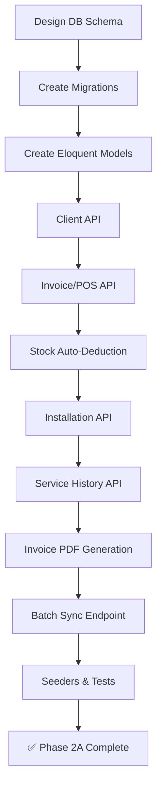
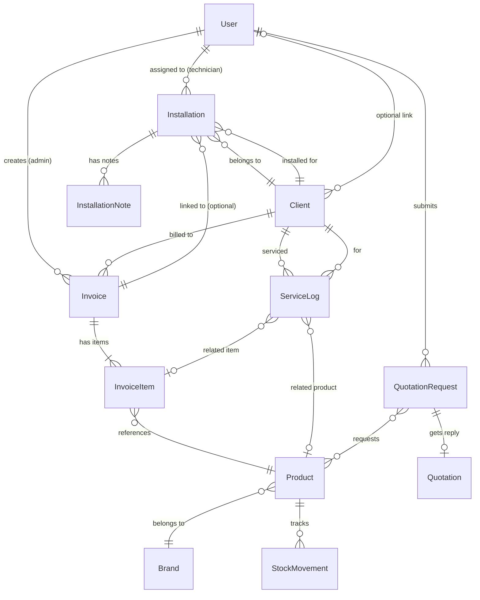
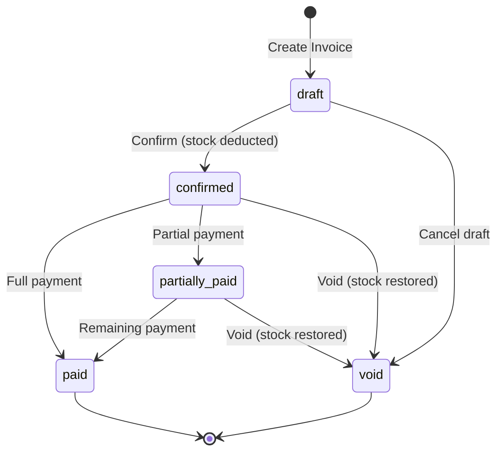

# Phase 2A — ERP Database Architecture & Backend APIs

> **Goal**: Design and implement the database schema, Eloquent models, API controllers, and backend business logic for Clients, Invoicing/POS, Installations, Service History, and Warranty Tracking.  
> **Estimated Duration**: 7–10 days  
> **Prerequisites**: Phase 1 complete (RBAC active, ERP frontend deployed)  
> **Branch**: `feature/phase-2a-database-backend`

---

## Table of Contents

1. [Phase Overview](#1-phase-overview)
2. [Task 2A.1 — Database Schema Design](#task-2a1--database-schema-design)
3. [Task 2A.2 — Eloquent Models](#task-2a2--eloquent-models)
4. [Task 2A.3 — Client Management API](#task-2a3--client-management-api)
5. [Task 2A.4 — Invoice / POS API](#task-2a4--invoice--pos-api)
6. [Task 2A.5 — Stock Management & Auto-Deduction](#task-2a5--stock-management--auto-deduction)
7. [Task 2A.6 — Installation Tracking API](#task-2a6--installation-tracking-api)
8. [Task 2A.7 — Service History & Warranty API](#task-2a7--service-history--warranty-api)
9. [Task 2A.8 — Invoice PDF Generation (SL Tax Compliant)](#task-2a8--invoice-pdf-generation-sl-tax-compliant)
10. [Task 2A.9 — Batch Sync Endpoint (Offline Idempotency)](#task-2a9--batch-sync-endpoint-offline-idempotency)
11. [Task 2A.10 — Seeders & Test Data](#task-2a10--seeders--test-data)
12. [Verification Checklist](#verification-checklist)
13. [Deliverables](#deliverables)

---

## 1. Phase Overview



### New Entity Relationship Diagram



---

## Task 2A.1 — Database Schema Design

> **Effort**: ~4 hours

### 2A.1.1 — Migration: `clients` Table

```bash
php artisan make:migration create_clients_table
```

```php
Schema::create('clients', function (Blueprint $table) {
    $table->id();
    $table->foreignId('user_id')->nullable()->constrained()->nullOnDelete();  // Optional link to users table
    
    // Business Information
    $table->string('company_name')->nullable();
    $table->string('contact_person');                    // Primary contact name
    $table->string('email')->nullable();
    $table->string('phone');
    $table->string('secondary_phone')->nullable();
    $table->string('nic')->nullable();                   // National Identity Card (Sri Lanka)
    
    // Address
    $table->text('address')->nullable();
    $table->string('city')->nullable();
    $table->string('district')->nullable();              // Sri Lanka district
    
    // Classification
    $table->enum('client_type', ['individual', 'business'])->default('individual');
    $table->string('tax_id')->nullable();                // Business Registration / TIN number
    
    // Notes
    $table->text('notes')->nullable();
    
    $table->timestamps();
    $table->softDeletes();
    
    // Indexes
    $table->index('phone');
    $table->index('email');
    $table->index('company_name');
});
```

### 2A.1.2 — Migration: `invoices` Table

```bash
php artisan make:migration create_invoices_table
```

```php
Schema::create('invoices', function (Blueprint $table) {
    $table->id();
    $table->uuid('uuid')->unique();                      // Offline idempotency key
    $table->string('invoice_number')->unique();          // Auto-generated: INV-2026-0001
    
    // Relations
    $table->foreignId('client_id')->constrained()->restrictOnDelete();
    $table->foreignId('created_by')->constrained('users')->restrictOnDelete();  // Sales person
    
    // Financial
    $table->decimal('subtotal', 12, 2)->default(0);
    $table->decimal('tax_rate', 5, 2)->default(0);       // Tax percentage (e.g., 18.00 for 18%)
    $table->decimal('tax_amount', 12, 2)->default(0);    // Calculated tax
    $table->decimal('discount_amount', 12, 2)->default(0);
    $table->enum('discount_type', ['fixed', 'percentage'])->default('fixed');
    $table->decimal('grand_total', 12, 2)->default(0);
    
    // Status
    $table->enum('status', [
        'draft',         // Created but not finalized
        'confirmed',     // Confirmed — stock deducted
        'paid',          // Payment received
        'partially_paid',
        'void',          // Cancelled / voided — stock restored
    ])->default('draft');
    
    // Payment
    $table->enum('payment_method', [
        'cash', 'card', 'bank_transfer', 'cheque', 'credit'
    ])->nullable();
    $table->decimal('amount_paid', 12, 2)->default(0);
    $table->date('payment_date')->nullable();
    
    // PDF
    $table->string('pdf_path')->nullable();
    
    // Metadata
    $table->text('notes')->nullable();
    $table->text('terms')->nullable();                   // Invoice terms & conditions
    $table->date('due_date')->nullable();
    
    // Offline sync
    $table->enum('sync_status', ['synced', 'pending'])->default('synced');
    $table->timestamp('synced_at')->nullable();
    
    $table->timestamps();
    $table->softDeletes();
    
    // Indexes
    $table->index('invoice_number');
    $table->index('status');
    $table->index('created_at');
    $table->index(['client_id', 'status']);
});
```

### 2A.1.3 — Migration: `invoice_items` Table

```bash
php artisan make:migration create_invoice_items_table
```

```php
Schema::create('invoice_items', function (Blueprint $table) {
    $table->id();
    $table->foreignId('invoice_id')->constrained()->cascadeOnDelete();
    $table->foreignId('product_id')->nullable()->constrained()->nullOnDelete();
    
    // Item Details (denormalized for historical accuracy)
    $table->string('product_name');                      // Snapshot at time of sale
    $table->string('product_model')->nullable();         // Model number snapshot
    $table->string('product_sku')->nullable();           // SKU snapshot
    $table->string('serial_number')->nullable();         // Unique per physical unit
    
    // Pricing
    $table->decimal('unit_price', 12, 2);
    $table->integer('quantity')->default(1);
    $table->string('unit')->default('pcs');               // pcs, meters, sets, etc.
    $table->decimal('line_total', 12, 2);                // unit_price × quantity
    
    // Warranty
    $table->integer('warranty_months')->default(0);      // Default from product, overridable
    $table->date('warranty_start_date')->nullable();     // Usually = invoice confirmed date
    $table->date('warranty_end_date')->nullable();       // Auto-calculated or manual override
    
    $table->text('notes')->nullable();
    $table->timestamps();
    
    // Indexes
    $table->index('serial_number');
    $table->index('warranty_end_date');
});
```

### 2A.1.4 — Migration: `installations` Table

```bash
php artisan make:migration create_installations_table
```

```php
Schema::create('installations', function (Blueprint $table) {
    $table->id();
    $table->string('reference_number')->unique();        // INST-2026-0001
    
    // Relations
    $table->foreignId('client_id')->constrained()->restrictOnDelete();
    $table->foreignId('invoice_id')->nullable()->constrained()->nullOnDelete();
    
    // Details
    $table->string('title');                              // e.g., "VFD Installation at Colombo Factory"
    $table->text('description')->nullable();
    $table->text('location');                             // Installation site address
    $table->string('location_coordinates')->nullable();   // GPS lat,lng for future map view
    
    // Status Tracking
    $table->enum('status', [
        'scheduled',     // Installation date set
        'in_progress',   // Technicians on site
        'completed',     // Installation finished
        'on_hold',       // Paused/waiting for parts
        'cancelled',
    ])->default('scheduled');
    
    $table->date('scheduled_date')->nullable();
    $table->date('started_date')->nullable();
    $table->date('completed_date')->nullable();
    
    // Priority
    $table->enum('priority', ['low', 'medium', 'high', 'urgent'])->default('medium');
    
    $table->text('notes')->nullable();
    $table->timestamps();
    $table->softDeletes();
    
    // Indexes
    $table->index('status');
    $table->index('scheduled_date');
    $table->index(['client_id', 'status']);
});
```

### 2A.1.5 — Migration: `installation_technicians` (Pivot)

```bash
php artisan make:migration create_installation_technicians_table
```

```php
Schema::create('installation_technicians', function (Blueprint $table) {
    $table->id();
    $table->foreignId('installation_id')->constrained()->cascadeOnDelete();
    $table->foreignId('user_id')->constrained()->cascadeOnDelete();  // Technician
    $table->enum('role', ['lead', 'assistant'])->default('assistant');
    $table->timestamps();
    
    $table->unique(['installation_id', 'user_id']);
});
```

### 2A.1.6 — Migration: `installation_notes` Table

```bash
php artisan make:migration create_installation_notes_table
```

```php
Schema::create('installation_notes', function (Blueprint $table) {
    $table->id();
    $table->foreignId('installation_id')->constrained()->cascadeOnDelete();
    $table->foreignId('user_id')->constrained()->restrictOnDelete();  // Who wrote the note
    
    $table->text('content');
    $table->json('attachments')->nullable();              // Photo URLs from site visits
    
    $table->timestamps();
});
```

### 2A.1.7 — Migration: `service_logs` Table

```bash
php artisan make:migration create_service_logs_table
```

```php
Schema::create('service_logs', function (Blueprint $table) {
    $table->id();
    $table->uuid('uuid')->unique();                      // Offline idempotency key
    
    // Relations
    $table->foreignId('client_id')->constrained()->restrictOnDelete();
    $table->foreignId('invoice_item_id')->nullable()->constrained()->nullOnDelete();  // Specific equipment
    $table->foreignId('product_id')->nullable()->constrained()->nullOnDelete();
    $table->foreignId('technician_id')->constrained('users')->restrictOnDelete();
    
    // Service Details
    $table->string('title');                              // e.g., "Annual VFD Maintenance"
    $table->text('description');                          // Work performed
    $table->text('diagnosis')->nullable();                // Problem found
    $table->text('resolution')->nullable();               // How it was fixed
    
    // Classification
    $table->enum('service_type', [
        'maintenance',       // Routine maintenance
        'repair',            // Breakdown repair
        'inspection',        // Periodic inspection
        'warranty_claim',    // Under warranty
        'installation_followup',
    ]);
    
    // Warranty Check (auto-calculated)
    $table->boolean('is_under_warranty')->default(false); // Auto-set based on warranty_end_date
    $table->boolean('is_chargeable')->default(true);      // false if under warranty
    $table->decimal('service_charge', 12, 2)->default(0);
    
    // Timing
    $table->date('service_date');
    $table->date('next_service_date')->nullable();        // Reminder for next visit
    
    // Status
    $table->enum('status', ['pending', 'completed', 'requires_followup'])->default('pending');
    
    // Attachments
    $table->json('photos')->nullable();                   // Before/after photos
    
    // Offline sync
    $table->enum('sync_status', ['synced', 'pending'])->default('synced');
    
    $table->text('notes')->nullable();
    $table->timestamps();
    $table->softDeletes();
    
    // Indexes
    $table->index('service_date');
    $table->index(['client_id', 'service_date']);
    $table->index('next_service_date');
    $table->index('is_under_warranty');
});
```

### 2A.1.8 — Migration: `stock_movements` Table (Audit Trail)

```bash
php artisan make:migration create_stock_movements_table
```

```php
Schema::create('stock_movements', function (Blueprint $table) {
    $table->id();
    $table->foreignId('product_id')->constrained()->cascadeOnDelete();
    $table->foreignId('user_id')->constrained()->restrictOnDelete();   // Who made the change
    
    $table->enum('type', [
        'sale',              // Stock reduced via invoice confirmation
        'void',              // Stock restored via invoice void
        'adjustment',        // Manual stock adjustment
        'received',          // New stock received
        'return',            // Customer return
    ]);
    
    $table->integer('quantity');                           // Positive = increase, Negative = decrease
    $table->integer('stock_before');                      // Stock level before this movement
    $table->integer('stock_after');                       // Stock level after this movement
    
    // Reference
    $table->string('reference_type')->nullable();         // 'invoice', 'adjustment', etc.
    $table->unsignedBigInteger('reference_id')->nullable(); // Invoice ID, etc.
    
    $table->text('notes')->nullable();
    $table->timestamps();
    
    // Indexes
    $table->index(['product_id', 'created_at']);
    $table->index('type');
});
```

### 2A.1.9 — Migration: Add `warranty_months` to `products` Table

```bash
php artisan make:migration add_warranty_months_to_products_table
```

```php
Schema::table('products', function (Blueprint $table) {
    $table->integer('warranty_months')->default(0)->after('show_price');
});
```

### 2A.1.10 — Complete Schema Summary

| Table | New/Modified | Rows (est.) | Purpose |
|-------|-------------|-------------|---------|
| `clients` | NEW | 100-500 | Business customer records |
| `invoices` | NEW | 1000-5000/yr | Sales invoices |
| `invoice_items` | NEW | 3000-15000/yr | Invoice line items with warranty |
| `installations` | NEW | 50-200/yr | Equipment installation projects |
| `installation_technicians` | NEW | 100-400/yr | Technician assignments |
| `installation_notes` | NEW | 200-800/yr | Field notes & photos |
| `service_logs` | NEW | 200-1000/yr | Maintenance & repair records |
| `stock_movements` | NEW | 5000-20000/yr | Stock audit trail |
| `products` | MODIFIED | existing | Added `warranty_months` |

---

## Task 2A.2 — Eloquent Models

> **Effort**: ~3 hours

### 2A.2.1 — `Client` Model

**File**: `app/Models/Client.php`

```php
<?php

namespace App\Models;

use Illuminate\Database\Eloquent\Factories\HasFactory;
use Illuminate\Database\Eloquent\Model;
use Illuminate\Database\Eloquent\SoftDeletes;

class Client extends Model
{
    use HasFactory, SoftDeletes;

    protected $fillable = [
        'user_id', 'company_name', 'contact_person', 'email', 'phone',
        'secondary_phone', 'nic', 'address', 'city', 'district',
        'client_type', 'tax_id', 'notes',
    ];

    // ── Relationships ────────────────────────────

    public function user()
    {
        return $this->belongsTo(User::class);
    }

    public function invoices()
    {
        return $this->hasMany(Invoice::class);
    }

    public function installations()
    {
        return $this->hasMany(Installation::class);
    }

    public function serviceLogs()
    {
        return $this->hasMany(ServiceLog::class);
    }

    // ── Accessors ────────────────────────────────

    public function getDisplayNameAttribute(): string
    {
        return $this->company_name ?: $this->contact_person;
    }

    // ── Scopes ───────────────────────────────────

    public function scopeSearch($query, string $term)
    {
        return $query->where(function ($q) use ($term) {
            $q->where('contact_person', 'like', "%{$term}%")
              ->orWhere('company_name', 'like', "%{$term}%")
              ->orWhere('phone', 'like', "%{$term}%")
              ->orWhere('email', 'like', "%{$term}%");
        });
    }
}
```

### 2A.2.2 — `Invoice` Model

**File**: `app/Models/Invoice.php`

```php
<?php

namespace App\Models;

use Illuminate\Database\Eloquent\Factories\HasFactory;
use Illuminate\Database\Eloquent\Model;
use Illuminate\Database\Eloquent\SoftDeletes;
use Illuminate\Support\Str;

class Invoice extends Model
{
    use HasFactory, SoftDeletes;

    protected $fillable = [
        'uuid', 'invoice_number', 'client_id', 'created_by',
        'subtotal', 'tax_rate', 'tax_amount', 'discount_amount',
        'discount_type', 'grand_total', 'status', 'payment_method',
        'amount_paid', 'payment_date', 'pdf_path', 'notes', 'terms',
        'due_date', 'sync_status', 'synced_at',
    ];

    protected $casts = [
        'subtotal' => 'decimal:2',
        'tax_rate' => 'decimal:2',
        'tax_amount' => 'decimal:2',
        'discount_amount' => 'decimal:2',
        'grand_total' => 'decimal:2',
        'amount_paid' => 'decimal:2',
        'payment_date' => 'date',
        'due_date' => 'date',
        'synced_at' => 'datetime',
    ];

    // ── Boot ─────────────────────────────────────

    protected static function boot()
    {
        parent::boot();

        static::creating(function ($invoice) {
            if (!$invoice->uuid) {
                $invoice->uuid = (string) Str::uuid();
            }
            if (!$invoice->invoice_number) {
                $invoice->invoice_number = self::generateInvoiceNumber();
            }
        });
    }

    public static function generateInvoiceNumber(): string
    {
        $year = now()->year;
        $lastInvoice = self::whereYear('created_at', $year)
            ->orderBy('id', 'desc')
            ->first();

        $sequence = $lastInvoice
            ? intval(substr($lastInvoice->invoice_number, -4)) + 1
            : 1;

        return sprintf('INV-%d-%04d', $year, $sequence);
    }

    // ── Relationships ────────────────────────────

    public function client()
    {
        return $this->belongsTo(Client::class);
    }

    public function createdBy()
    {
        return $this->belongsTo(User::class, 'created_by');
    }

    public function items()
    {
        return $this->hasMany(InvoiceItem::class);
    }

    public function installation()
    {
        return $this->hasOne(Installation::class);
    }

    public function stockMovements()
    {
        return $this->morphMany(StockMovement::class, 'reference');
    }

    // ── Business Logic ───────────────────────────

    public function calculateTotals(): void
    {
        $this->subtotal = $this->items->sum('line_total');

        if ($this->discount_type === 'percentage') {
            $discountValue = $this->subtotal * ($this->discount_amount / 100);
        } else {
            $discountValue = $this->discount_amount;
        }

        $taxableAmount = $this->subtotal - $discountValue;
        $this->tax_amount = $taxableAmount * ($this->tax_rate / 100);
        $this->grand_total = $taxableAmount + $this->tax_amount;
    }

    public function getBalanceDueAttribute(): float
    {
        return $this->grand_total - $this->amount_paid;
    }

    public function isPaid(): bool
    {
        return $this->amount_paid >= $this->grand_total;
    }

    // ── Scopes ───────────────────────────────────

    public function scopeStatus($query, string $status)
    {
        return $query->where('status', $status);
    }

    public function scopeDateRange($query, $from, $to)
    {
        return $query->whereBetween('created_at', [$from, $to]);
    }
}
```

### 2A.2.3 — `InvoiceItem` Model

**File**: `app/Models/InvoiceItem.php`

```php
<?php

namespace App\Models;

use Illuminate\Database\Eloquent\Factories\HasFactory;
use Illuminate\Database\Eloquent\Model;

class InvoiceItem extends Model
{
    use HasFactory;

    protected $fillable = [
        'invoice_id', 'product_id', 'product_name', 'product_model',
        'product_sku', 'serial_number', 'unit_price', 'quantity',
        'unit', 'line_total', 'warranty_months', 'warranty_start_date',
        'warranty_end_date', 'notes',
    ];

    protected $casts = [
        'unit_price' => 'decimal:2',
        'line_total' => 'decimal:2',
        'warranty_start_date' => 'date',
        'warranty_end_date' => 'date',
    ];

    // ── Boot ─────────────────────────────────────

    protected static function boot()
    {
        parent::boot();

        static::creating(function ($item) {
            $item->line_total = $item->unit_price * $item->quantity;
        });

        static::updating(function ($item) {
            $item->line_total = $item->unit_price * $item->quantity;
        });
    }

    // ── Relationships ────────────────────────────

    public function invoice()
    {
        return $this->belongsTo(Invoice::class);
    }

    public function product()
    {
        return $this->belongsTo(Product::class);
    }

    public function serviceLogs()
    {
        return $this->hasMany(ServiceLog::class);
    }

    // ── Business Logic ───────────────────────────

    public function isUnderWarranty(): bool
    {
        if (!$this->warranty_end_date) {
            return false;
        }
        return now()->lte($this->warranty_end_date);
    }

    /**
     * Set warranty dates based on a confirmation date and warranty_months.
     */
    public function setWarrantyDates(?\Carbon\Carbon $startDate = null): void
    {
        $start = $startDate ?? now();
        $this->warranty_start_date = $start;

        if ($this->warranty_months > 0) {
            $this->warranty_end_date = $start->copy()->addMonths($this->warranty_months);
        }
    }
}
```

### 2A.2.4 — `Installation` Model

**File**: `app/Models/Installation.php`

```php
<?php

namespace App\Models;

use Illuminate\Database\Eloquent\Factories\HasFactory;
use Illuminate\Database\Eloquent\Model;
use Illuminate\Database\Eloquent\SoftDeletes;

class Installation extends Model
{
    use HasFactory, SoftDeletes;

    protected $fillable = [
        'reference_number', 'client_id', 'invoice_id', 'title',
        'description', 'location', 'location_coordinates', 'status',
        'scheduled_date', 'started_date', 'completed_date',
        'priority', 'notes',
    ];

    protected $casts = [
        'scheduled_date' => 'date',
        'started_date' => 'date',
        'completed_date' => 'date',
    ];

    protected static function boot()
    {
        parent::boot();

        static::creating(function ($installation) {
            if (!$installation->reference_number) {
                $installation->reference_number = self::generateReferenceNumber();
            }
        });
    }

    public static function generateReferenceNumber(): string
    {
        $year = now()->year;
        $last = self::whereYear('created_at', $year)->orderBy('id', 'desc')->first();
        $sequence = $last ? intval(substr($last->reference_number, -4)) + 1 : 1;
        return sprintf('INST-%d-%04d', $year, $sequence);
    }

    // ── Relationships ────────────────────────────

    public function client()
    {
        return $this->belongsTo(Client::class);
    }

    public function invoice()
    {
        return $this->belongsTo(Invoice::class);
    }

    public function technicians()
    {
        return $this->belongsToMany(User::class, 'installation_technicians')
                    ->withPivot('role')
                    ->withTimestamps();
    }

    public function notes()
    {
        return $this->hasMany(InstallationNote::class)->orderBy('created_at', 'desc');
    }

    // ── Scopes ───────────────────────────────────

    public function scopeAssignedTo($query, int $userId)
    {
        return $query->whereHas('technicians', fn($q) => $q->where('user_id', $userId));
    }

    public function scopeActive($query)
    {
        return $query->whereIn('status', ['scheduled', 'in_progress']);
    }
}
```

### 2A.2.5 — `InstallationNote` Model

**File**: `app/Models/InstallationNote.php`

```php
<?php

namespace App\Models;

use Illuminate\Database\Eloquent\Model;

class InstallationNote extends Model
{
    protected $fillable = ['installation_id', 'user_id', 'content', 'attachments'];

    protected $casts = [
        'attachments' => 'array',
    ];

    public function installation()
    {
        return $this->belongsTo(Installation::class);
    }

    public function user()
    {
        return $this->belongsTo(User::class);
    }
}
```

### 2A.2.6 — `ServiceLog` Model

**File**: `app/Models/ServiceLog.php`

```php
<?php

namespace App\Models;

use Illuminate\Database\Eloquent\Factories\HasFactory;
use Illuminate\Database\Eloquent\Model;
use Illuminate\Database\Eloquent\SoftDeletes;

class ServiceLog extends Model
{
    use HasFactory, SoftDeletes;

    protected $fillable = [
        'uuid', 'client_id', 'invoice_item_id', 'product_id',
        'technician_id', 'title', 'description', 'diagnosis',
        'resolution', 'service_type', 'is_under_warranty',
        'is_chargeable', 'service_charge', 'service_date',
        'next_service_date', 'status', 'photos', 'sync_status', 'notes',
    ];

    protected $casts = [
        'service_date' => 'date',
        'next_service_date' => 'date',
        'service_charge' => 'decimal:2',
        'is_under_warranty' => 'boolean',
        'is_chargeable' => 'boolean',
        'photos' => 'array',
    ];

    // ── Relationships ────────────────────────────

    public function client()
    {
        return $this->belongsTo(Client::class);
    }

    public function invoiceItem()
    {
        return $this->belongsTo(InvoiceItem::class);
    }

    public function product()
    {
        return $this->belongsTo(Product::class);
    }

    public function technician()
    {
        return $this->belongsTo(User::class, 'technician_id');
    }

    // ── Business Logic ───────────────────────────

    /**
     * Auto-detect warranty status from linked invoice item.
     */
    public function checkWarranty(): void
    {
        if ($this->invoiceItem && $this->invoiceItem->isUnderWarranty()) {
            $this->is_under_warranty = true;
            $this->is_chargeable = false;
        }
    }
}
```

### 2A.2.7 — `StockMovement` Model

**File**: `app/Models/StockMovement.php`

```php
<?php

namespace App\Models;

use Illuminate\Database\Eloquent\Model;

class StockMovement extends Model
{
    protected $fillable = [
        'product_id', 'user_id', 'type', 'quantity',
        'stock_before', 'stock_after', 'reference_type',
        'reference_id', 'notes',
    ];

    public function product()
    {
        return $this->belongsTo(Product::class);
    }

    public function user()
    {
        return $this->belongsTo(User::class);
    }
}
```

### 2A.2.8 — Update Existing `Product` Model

**File**: `app/Models/Product.php` — Add warranty relationship and stock methods

```php
// Add to existing Product model:

protected $fillable = [
    // ... existing fields ...
    'warranty_months',  // ← ADD
];

// New relationships
public function invoiceItems()
{
    return $this->hasMany(InvoiceItem::class);
}

public function stockMovements()
{
    return $this->hasMany(StockMovement::class);
}

// Stock management methods
public function deductStock(int $quantity, int $userId, ?int $invoiceId = null): StockMovement
{
    $stockBefore = $this->stock;
    $this->stock -= $quantity;
    $this->updateStockStatus();
    $this->save();

    return StockMovement::create([
        'product_id' => $this->id,
        'user_id' => $userId,
        'type' => 'sale',
        'quantity' => -$quantity,
        'stock_before' => $stockBefore,
        'stock_after' => $this->stock,
        'reference_type' => 'invoice',
        'reference_id' => $invoiceId,
    ]);
}

public function restoreStock(int $quantity, int $userId, ?int $invoiceId = null): StockMovement
{
    $stockBefore = $this->stock;
    $this->stock += $quantity;
    $this->updateStockStatus();
    $this->save();

    return StockMovement::create([
        'product_id' => $this->id,
        'user_id' => $userId,
        'type' => 'void',
        'quantity' => $quantity,
        'stock_before' => $stockBefore,
        'stock_after' => $this->stock,
        'reference_type' => 'invoice',
        'reference_id' => $invoiceId,
    ]);
}

private function updateStockStatus(): void
{
    if ($this->stock <= 0) {
        $this->stock_status = 'out_of_stock';
    } elseif ($this->stock <= 5) {
        $this->stock_status = 'low_stock';
    } else {
        $this->stock_status = 'in_stock';
    }
}
```

---

## Task 2A.3 — Client Management API

> **Effort**: ~2 hours

### Controller: `ClientController`

```bash
php artisan make:controller ClientController --resource
```

**Endpoints**:

| Method | Endpoint | Permission | Description |
|--------|----------|-----------|-------------|
| GET | `/api/clients` | `clients.view` | List all clients (paginated, searchable) |
| GET | `/api/clients/{id}` | `clients.view` | Get single client with relations |
| POST | `/api/clients` | `clients.create` | Create new client |
| PUT | `/api/clients/{id}` | `clients.edit` | Update client |
| DELETE | `/api/clients/{id}` | `clients.delete` | Soft-delete client |
| GET | `/api/clients/{id}/history` | `clients.view` | Full client history (invoices, installations, services) |

**Search/Filter params**: `?search=`, `?type=business`, `?city=`, `?page=`

---

## Task 2A.4 — Invoice / POS API

> **Effort**: ~4 hours

### Controller: `InvoiceController`

```bash
php artisan make:controller InvoiceController --resource
```

**Endpoints**:

| Method | Endpoint | Permission | Description |
|--------|----------|-----------|-------------|
| GET | `/api/invoices` | `invoices.view` | List invoices (paginated, filterable) |
| GET | `/api/invoices/{id}` | `invoices.view` | Single invoice with items & client |
| POST | `/api/invoices` | `invoices.create` | Create invoice (draft status) |
| PUT | `/api/invoices/{id}` | `invoices.edit` | Update draft invoice |
| POST | `/api/invoices/{id}/confirm` | `invoices.create` | Confirm invoice → deduct stock |
| POST | `/api/invoices/{id}/payment` | `invoices.edit` | Record payment |
| POST | `/api/invoices/{id}/void` | `invoices.void` | Void invoice → restore stock |
| GET | `/api/invoices/{id}/pdf` | `invoices.view` | Download/generate PDF |
| POST | `/api/invoices/batch` | `invoices.create` | Batch sync from offline (UUID idempotent) |

**Filter params**: `?status=`, `?client_id=`, `?from=`, `?to=`, `?search=`, `?page=`

### Invoice Lifecycle



### Create Invoice Request Body

```json
{
  "uuid": "550e8400-e29b-41d4-a716-446655440000",
  "client_id": 1,
  "items": [
    {
      "product_id": 5,
      "quantity": 2,
      "unit_price": 45000.00,
      "serial_number": "VFD-2026-001",
      "warranty_months": 24,
      "notes": "Installed at main panel"
    },
    {
      "product_id": 12,
      "quantity": 5,
      "unit_price": 1200.00,
      "warranty_months": 12
    }
  ],
  "tax_rate": 18.00,
  "discount_amount": 5000.00,
  "discount_type": "fixed",
  "payment_method": "bank_transfer",
  "notes": "Payment within 30 days",
  "terms": "Goods once sold cannot be returned",
  "due_date": "2026-10-01"
}
```

---

## Task 2A.5 — Stock Management & Auto-Deduction

> **Effort**: ~2 hours

### Stock Deduction Flow (on Invoice Confirmation)

```php
// InvoiceController::confirm()

public function confirm(Invoice $invoice)
{
    $this->authorize('create', Invoice::class); // Or permission check

    if ($invoice->status !== 'draft') {
        return response()->json(['message' => 'Only draft invoices can be confirmed.'], 422);
    }

    DB::transaction(function () use ($invoice) {
        // 1. Check stock availability for all items
        foreach ($invoice->items as $item) {
            if ($item->product_id) {
                $product = Product::lockForUpdate()->find($item->product_id);
                if ($product->stock < $item->quantity) {
                    throw new \Exception("Insufficient stock for {$product->name}. Available: {$product->stock}, Requested: {$item->quantity}");
                }
            }
        }

        // 2. Deduct stock and set warranty dates
        foreach ($invoice->items as $item) {
            if ($item->product_id) {
                $product = Product::find($item->product_id);
                $product->deductStock($item->quantity, auth()->id(), $invoice->id);
            }

            // Set warranty dates
            $item->setWarrantyDates(now());
            $item->save();
        }

        // 3. Update invoice status
        $invoice->update(['status' => 'confirmed']);
    });

    return response()->json([
        'message' => 'Invoice confirmed. Stock has been deducted.',
        'data' => $invoice->fresh(['items', 'client']),
    ]);
}
```

### Stock Restoration Flow (on Invoice Void)

```php
// InvoiceController::void()

public function void(Invoice $invoice)
{
    if (!in_array($invoice->status, ['confirmed', 'paid', 'partially_paid'])) {
        return response()->json(['message' => 'Cannot void this invoice.'], 422);
    }

    DB::transaction(function () use ($invoice) {
        foreach ($invoice->items as $item) {
            if ($item->product_id) {
                $product = Product::find($item->product_id);
                $product->restoreStock($item->quantity, auth()->id(), $invoice->id);
            }
        }

        $invoice->update(['status' => 'void']);
    });

    return response()->json(['message' => 'Invoice voided. Stock has been restored.']);
}
```

### Inventory Endpoints

| Method | Endpoint | Permission | Description |
|--------|----------|-----------|-------------|
| GET | `/api/inventory` | `inventory.view` | Products with stock levels |
| POST | `/api/inventory/{product_id}/adjust` | `inventory.adjust` | Manual stock adjustment |
| POST | `/api/inventory/{product_id}/receive` | `inventory.receive` | Receive new stock |
| GET | `/api/inventory/{product_id}/movements` | `inventory.view` | Stock movement history |

---

## Task 2A.6 — Installation Tracking API

> **Effort**: ~2 hours

### Controller: `InstallationController`

**Endpoints**:

| Method | Endpoint | Permission | Description |
|--------|----------|-----------|-------------|
| GET | `/api/installations` | `installations.view` | List (paginated, filterable) |
| GET | `/api/installations/{id}` | `installations.view` | Single with technicians & notes |
| POST | `/api/installations` | `installations.create` | Create installation |
| PUT | `/api/installations/{id}` | `installations.edit` | Update details |
| PATCH | `/api/installations/{id}/status` | `installations.update_status` | Update status (technician-accessible) |
| POST | `/api/installations/{id}/notes` | `installations.update_status` | Add field note |
| POST | `/api/installations/{id}/assign` | `installations.edit` | Assign technicians |

**Filter params**: `?status=`, `?client_id=`, `?technician_id=`, `?from=`, `?to=`, `?priority=`

### Technician-Specific Endpoint

```
GET /api/my-installations
```
- Uses `auth()->id()` to filter installations assigned to the logged-in technician
- Permission: `installations.view` (Technicians have this)
- Returns only the technician's assigned installations

---

## Task 2A.7 — Service History & Warranty API

> **Effort**: ~2 hours

### Controller: `ServiceLogController`

**Endpoints**:

| Method | Endpoint | Permission | Description |
|--------|----------|-----------|-------------|
| GET | `/api/service-logs` | `service_logs.view` | List (paginated) |
| GET | `/api/service-logs/{id}` | `service_logs.view` | Single with client & product |
| POST | `/api/service-logs` | `service_logs.create` | Create log |
| PUT | `/api/service-logs/{id}` | `service_logs.edit` | Update log |
| POST | `/api/service-logs/batch` | `service_logs.create` | Batch sync from offline |

### Warranty Check Endpoint

```
GET /api/warranty/check?serial_number=VFD-2026-001
GET /api/warranty/check?client_id=5&product_id=12
```

Returns:
```json
{
  "is_under_warranty": true,
  "warranty_start_date": "2026-03-15",
  "warranty_end_date": "2028-03-15",
  "days_remaining": 561,
  "invoice_number": "INV-2026-0042",
  "product_name": "ABB ACS355 VFD 5.5kW",
  "client": { "company_name": "Lanka Tiles Ltd" }
}
```

### Warranty Expiry Alerts

```
GET /api/warranty/expiring?days=30
```

Returns all invoice items with warranties expiring within `days` days.

---

## Task 2A.8 — Invoice PDF Generation (SL Tax Compliant)

> **Effort**: ~4 hours

### Sri Lanka Tax Compliance Requirements

The invoice PDF must include:

1. **Company Header** (reuse existing quotation template):
   - Company Name: TiTEC Automation
   - Company Logo
   - Business Registration Number
   - TIN (Taxpayer Identification Number)
   - Company Address, Phone, Email
   
2. **Invoice Details**:
   - Invoice Number (sequential)
   - Invoice Date
   - Due Date
   - Payment Terms

3. **Client Details**:
   - Client/Company Name
   - Address
   - TIN (if business client)

4. **Itemized Table**:
   - Item #, Description, Model/SKU, Qty, Unit, Unit Price, Line Total
   
5. **Tax Breakdown**:
   - Subtotal
   - Discount (if any)
   - Taxable Amount
   - Tax Rate & Amount (VAT/SVAT)
   - Grand Total

6. **Footer**:
   - Payment instructions (bank details)
   - Terms & Conditions
   - Authorized Signature line

### Implementation

- Use existing `barryvdh/laravel-dompdf` package (already installed)
- Create Blade template: `resources/views/pdf/invoice.blade.php`
- Reference existing quotation PDF template for company header styling

```php
// InvoiceController::generatePdf()

public function generatePdf(Invoice $invoice)
{
    $invoice->load(['client', 'items.product', 'createdBy']);

    $pdf = PDF::loadView('pdf.invoice', [
        'invoice' => $invoice,
        'company' => config('company'),  // Company details from config
    ]);

    $filename = "invoice_{$invoice->invoice_number}.pdf";
    $path = "invoices/{$filename}";

    Storage::disk('public')->put($path, $pdf->output());

    $invoice->update(['pdf_path' => $path]);

    return $pdf->download($filename);
}
```

### Company Config

**File**: `config/company.php`

```php
<?php

return [
    'name' => 'TiTEC Automation (Pvt) Ltd',
    'registration_number' => env('COMPANY_REG_NUMBER', ''),
    'tin' => env('COMPANY_TIN', ''),
    'address' => 'No. XX, XXXX Road, Colombo, Sri Lanka',
    'phone' => '+94 XX XXX XXXX',
    'email' => 'info@titecautomation.lk',
    'website' => 'https://titecautomation.lk',
    'bank_name' => '',
    'bank_branch' => '',
    'bank_account_number' => '',
    'bank_account_name' => 'TiTEC Automation (Pvt) Ltd',
];
```

---

## Task 2A.9 — Batch Sync Endpoint (Offline Idempotency)

> **Effort**: ~2 hours

### Batch Invoice Sync

```php
// InvoiceController::batch()

public function batch(Request $request)
{
    $request->validate([
        'invoices' => 'required|array',
        'invoices.*.uuid' => 'required|uuid',
        'invoices.*.client_id' => 'required|exists:clients,id',
        'invoices.*.items' => 'required|array|min:1',
    ]);

    $results = [];

    foreach ($request->invoices as $invoiceData) {
        // UUID-based idempotency — skip if already exists
        $existing = Invoice::where('uuid', $invoiceData['uuid'])->first();

        if ($existing) {
            $results[] = [
                'uuid' => $invoiceData['uuid'],
                'status' => 'already_exists',
                'invoice_id' => $existing->id,
                'invoice_number' => $existing->invoice_number,
            ];
            continue;
        }

        DB::beginTransaction();
        try {
            $invoice = Invoice::create([
                'uuid' => $invoiceData['uuid'],
                'client_id' => $invoiceData['client_id'],
                'created_by' => auth()->id(),
                'status' => 'draft',
                'tax_rate' => $invoiceData['tax_rate'] ?? 0,
                'discount_amount' => $invoiceData['discount_amount'] ?? 0,
                'discount_type' => $invoiceData['discount_type'] ?? 'fixed',
                'payment_method' => $invoiceData['payment_method'] ?? null,
                'notes' => $invoiceData['notes'] ?? null,
                'sync_status' => 'synced',
                'synced_at' => now(),
            ]);

            foreach ($invoiceData['items'] as $itemData) {
                $product = Product::find($itemData['product_id']);
                $warrantyMonths = $itemData['warranty_months'] ?? ($product?->warranty_months ?? 0);

                $invoice->items()->create([
                    'product_id' => $itemData['product_id'],
                    'product_name' => $product?->name ?? $itemData['product_name'] ?? 'Unknown',
                    'product_model' => $product?->model_number ?? null,
                    'product_sku' => $product?->sku ?? null,
                    'serial_number' => $itemData['serial_number'] ?? null,
                    'unit_price' => $itemData['unit_price'],
                    'quantity' => $itemData['quantity'],
                    'unit' => $itemData['unit'] ?? 'pcs',
                    'line_total' => $itemData['unit_price'] * $itemData['quantity'],
                    'warranty_months' => $warrantyMonths,
                ]);
            }

            $invoice->calculateTotals();
            $invoice->save();

            DB::commit();

            $results[] = [
                'uuid' => $invoiceData['uuid'],
                'status' => 'created',
                'invoice_id' => $invoice->id,
                'invoice_number' => $invoice->invoice_number,
            ];
        } catch (\Exception $e) {
            DB::rollBack();
            \Log::error('Batch invoice sync failed', [
                'uuid' => $invoiceData['uuid'],
                'error' => $e->getMessage(),
            ]);

            $results[] = [
                'uuid' => $invoiceData['uuid'],
                'status' => 'error',
                'message' => 'Failed to create invoice.',
            ];
        }
    }

    return response()->json([
        'message' => 'Batch sync completed.',
        'results' => $results,
    ]);
}
```

### Batch Service Log Sync

Similar pattern using `ServiceLog` model with UUID idempotency.

---

## Task 2A.10 — Seeders & Test Data

> **Effort**: ~1 hour

### Create Seeders

```bash
php artisan make:seeder ClientSeeder
php artisan make:seeder InvoiceSeeder
php artisan make:seeder InstallationSeeder
php artisan make:seeder ServiceLogSeeder
```

- **ClientSeeder**: 10-20 sample clients (mix of individual and business)
- **InvoiceSeeder**: 5-10 sample invoices using existing products
- **InstallationSeeder**: 3-5 sample installations
- **ServiceLogSeeder**: 5-10 service log entries

Update `DatabaseSeeder` to include new seeders.

---

## Verification Checklist

### Database Verification

| # | Test | Command/Method |
|---|------|---------------|
| 1 | All migrations run cleanly | `php artisan migrate:fresh --seed` |
| 2 | No FK constraint errors | Check all foreign keys resolve |
| 3 | Indexes created correctly | `SHOW INDEXES FROM invoices` |
| 4 | Seeders populate data | `php artisan db:seed` |

### API Verification

| # | Endpoint | Test |
|---|----------|------|
| 1 | `POST /api/clients` | Create client → 201 |
| 2 | `GET /api/clients` | List with search → paginated results |
| 3 | `POST /api/invoices` | Create draft invoice with items → 201 |
| 4 | `POST /api/invoices/{id}/confirm` | Stock deducted, warranty dates set |
| 5 | `POST /api/invoices/{id}/void` | Stock restored |
| 6 | `GET /api/invoices/{id}/pdf` | PDF downloads with correct layout |
| 7 | `POST /api/invoices/batch` | Duplicate UUID → `already_exists` |
| 8 | `POST /api/installations` | Create with technicians → 201 |
| 9 | `PATCH /api/installations/{id}/status` | Status updates correctly |
| 10 | `POST /api/service-logs` | Auto warranty check works |
| 11 | `GET /api/warranty/check?serial_number=X` | Returns correct warranty info |
| 12 | `POST /api/inventory/{id}/adjust` | Stock movement recorded |

### RBAC Verification

| # | Test | Expected |
|---|------|----------|
| 1 | Sales creates invoice | ✅ 201 |
| 2 | Accountant creates invoice | ❌ 403 |
| 3 | Technician updates installation status | ✅ 200 |
| 4 | Technician creates installation | ❌ 403 |
| 5 | Store Keeper adjusts stock | ✅ 200 |
| 6 | Store Keeper views invoices | ❌ 403 |

---

## Deliverables

| # | Deliverable | Files |
|---|-------------|-------|
| 1 | 9 new migrations | `database/migrations/` |
| 2 | 7 new Eloquent models | `app/Models/` |
| 3 | 5 new controllers | `app/Http/Controllers/` |
| 4 | Updated API routes | `routes/api.php` |
| 5 | Invoice PDF template | `resources/views/pdf/invoice.blade.php` |
| 6 | Company config | `config/company.php` |
| 7 | Batch sync endpoint | UUID-based idempotency |
| 8 | Stock movement audit trail | `stock_movements` table |
| 9 | 4 new seeders | `database/seeders/` |
| 10 | Updated Product model | Warranty + stock methods |

---

*Previous Phase: [Phase 1 — Admin Migration & RBAC](./Phase-1-Admin-Migration-RBAC.md)*  
*Next Phase: [Phase 2B — ERP Frontend Features](./Phase-2B-Frontend-Features.md)*
