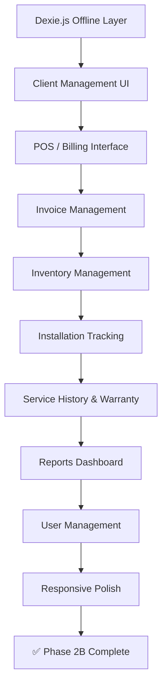

# Phase 2B — ERP Frontend Features (Offline-First POS, Installations, Service History, Reports)

> **Goal**: Build the ERP frontend UI for all Phase 2 features — offline-capable POS/billing, client management, installation tracking, service history, warranty checking, and reporting dashboard.  
> **Estimated Duration**: 10–14 days  
> **Prerequisites**: Phase 2A complete (all backend APIs working and tested)  
> **Branch**: `feature/phase-2b-frontend-features`

---

## Table of Contents

1. [Phase Overview](#1-phase-overview)
2. [Task 2B.1 — Offline-First Architecture (Dexie.js + Sync)](#task-2b1--offline-first-architecture-dexiejs--sync)
3. [Task 2B.2 — Client Management UI](#task-2b2--client-management-ui)
4. [Task 2B.3 — POS / Billing Interface](#task-2b3--pos--billing-interface)
5. [Task 2B.4 — Invoice Management & PDF](#task-2b4--invoice-management--pdf)
6. [Task 2B.5 — Inventory Management UI](#task-2b5--inventory-management-ui)
7. [Task 2B.6 — Installation Tracking UI](#task-2b6--installation-tracking-ui)
8. [Task 2B.7 — Service History & Warranty UI](#task-2b7--service-history--warranty-ui)
9. [Task 2B.8 — Reports & Analytics Dashboard](#task-2b8--reports--analytics-dashboard)
10. [Task 2B.9 — User Management UI](#task-2b9--user-management-ui)
11. [Task 2B.10 — Responsive Design & Polish](#task-2b10--responsive-design--polish)
12. [Verification Checklist](#verification-checklist)
13. [Deliverables](#deliverables)

---

## 1. Phase Overview



### Updated Sidebar Navigation

After Phase 2B, the ERP sidebar will have:

```
📊  Dashboard
📝  Quotation Requests
────────────────────
💼  Clients
🏷️  POS / Billing
📦  Inventory
📄  Invoices
────────────────────
🔧  Installations
📋  Service History
🛡️  Warranty Check
────────────────────
📊  Reports
────────────────────
📁  Products
🏗️  Projects
🏷️  Brands
🔩  Services
⚙️  Settings
```

---

## Task 2B.1 — Offline-First Architecture (Dexie.js + Sync)

> **Effort**: ~4 hours

### 2B.1.1 — Install Dependencies

```bash
cd frontend-erp
npm install dexie uuid
npm install --save-dev @types/uuid
```

### 2B.1.2 — Dexie.js Database Schema

**File**: `frontend-erp/src/lib/offline-db.ts`

```typescript
import Dexie, { type Table } from 'dexie';

// ── Types ────────────────────────────────────────

export interface PendingInvoice {
  uuid: string;                    // Primary key (UUID v4)
  client_id: number;
  client_name: string;             // Denormalized for offline display
  items: PendingInvoiceItem[];
  tax_rate: number;
  discount_amount: number;
  discount_type: 'fixed' | 'percentage';
  subtotal: number;
  tax_amount: number;
  grand_total: number;
  payment_method?: string;
  notes?: string;
  terms?: string;
  due_date?: string;
  status: 'pending' | 'syncing' | 'synced' | 'error';
  error_message?: string;
  created_at: number;              // timestamp
  updated_at: number;
}

export interface PendingInvoiceItem {
  product_id: number;
  product_name: string;
  product_model?: string;
  unit_price: number;
  quantity: number;
  unit: string;
  serial_number?: string;
  warranty_months: number;
  line_total: number;
}

export interface PendingServiceLog {
  uuid: string;                    // Primary key (UUID v4)
  client_id: number;
  client_name: string;
  invoice_item_id?: number;
  product_id?: number;
  product_name?: string;
  technician_id: number;
  title: string;
  description: string;
  diagnosis?: string;
  resolution?: string;
  service_type: string;
  service_date: string;
  next_service_date?: string;
  service_charge: number;
  status: 'pending' | 'syncing' | 'synced' | 'error';
  error_message?: string;
  created_at: number;
  updated_at: number;
}

// ── Database Class ───────────────────────────────

class OfflineDB extends Dexie {
  pendingInvoices!: Table<PendingInvoice, string>;
  pendingServiceLogs!: Table<PendingServiceLog, string>;

  constructor() {
    super('TiTEC_ERP_Offline');

    this.version(1).stores({
      pendingInvoices: 'uuid, client_id, status, created_at',
      pendingServiceLogs: 'uuid, client_id, status, created_at',
    });
  }
}

export const offlineDb = new OfflineDB();
```

### 2B.1.3 — Sync Service

**File**: `frontend-erp/src/services/syncService.ts`

```typescript
import { offlineDb, PendingInvoice, PendingServiceLog } from '@/lib/offline-db';
import api from '@/services/api';

class SyncService {
  private isSyncing = false;

  // ── Initialize ─────────────────────────────

  init(): void {
    // Listen for online events
    window.addEventListener('online', () => this.syncAll());

    // Sync on startup if online
    if (navigator.onLine) {
      this.syncAll();
    }
  }

  // ── Sync All Pending Records ───────────────

  async syncAll(): Promise<SyncResult> {
    if (this.isSyncing) {
      return { invoices: 0, serviceLogs: 0, errors: [] };
    }

    this.isSyncing = true;
    const result: SyncResult = { invoices: 0, serviceLogs: 0, errors: [] };

    try {
      result.invoices = await this.syncInvoices();
      result.serviceLogs = await this.syncServiceLogs();
    } catch (error) {
      result.errors.push(String(error));
    } finally {
      this.isSyncing = false;
    }

    return result;
  }

  // ── Sync Pending Invoices ──────────────────

  private async syncInvoices(): Promise<number> {
    const pending = await offlineDb.pendingInvoices
      .where('status')
      .equals('pending')
      .toArray();

    if (pending.length === 0) return 0;

    // Mark as syncing
    await Promise.all(
      pending.map(inv =>
        offlineDb.pendingInvoices.update(inv.uuid, { status: 'syncing' })
      )
    );

    try {
      const response = await api.post('/invoices/batch', {
        invoices: pending.map(inv => ({
          uuid: inv.uuid,
          client_id: inv.client_id,
          items: inv.items,
          tax_rate: inv.tax_rate,
          discount_amount: inv.discount_amount,
          discount_type: inv.discount_type,
          payment_method: inv.payment_method,
          notes: inv.notes,
          terms: inv.terms,
          due_date: inv.due_date,
        })),
      });

      // Process results
      let synced = 0;
      for (const result of response.data.results) {
        if (result.status === 'created' || result.status === 'already_exists') {
          await offlineDb.pendingInvoices.update(result.uuid, {
            status: 'synced',
            updated_at: Date.now(),
          });
          synced++;
        } else {
          await offlineDb.pendingInvoices.update(result.uuid, {
            status: 'error',
            error_message: result.message,
            updated_at: Date.now(),
          });
        }
      }

      // Clean up synced records (keep for 24h for reference)
      const cutoff = Date.now() - 24 * 60 * 60 * 1000;
      await offlineDb.pendingInvoices
        .where('status').equals('synced')
        .and(inv => inv.updated_at < cutoff)
        .delete();

      return synced;
    } catch (error) {
      // Revert to pending on network error
      await Promise.all(
        pending.map(inv =>
          offlineDb.pendingInvoices.update(inv.uuid, { status: 'pending' })
        )
      );
      throw error;
    }
  }

  // ── Sync Pending Service Logs ──────────────

  private async syncServiceLogs(): Promise<number> {
    // Similar pattern to syncInvoices
    const pending = await offlineDb.pendingServiceLogs
      .where('status')
      .equals('pending')
      .toArray();

    if (pending.length === 0) return 0;

    try {
      const response = await api.post('/service-logs/batch', {
        service_logs: pending.map(log => ({
          uuid: log.uuid,
          client_id: log.client_id,
          invoice_item_id: log.invoice_item_id,
          product_id: log.product_id,
          technician_id: log.technician_id,
          title: log.title,
          description: log.description,
          diagnosis: log.diagnosis,
          resolution: log.resolution,
          service_type: log.service_type,
          service_date: log.service_date,
          next_service_date: log.next_service_date,
          service_charge: log.service_charge,
        })),
      });

      let synced = 0;
      for (const result of response.data.results) {
        if (result.status === 'created' || result.status === 'already_exists') {
          await offlineDb.pendingServiceLogs.update(result.uuid, {
            status: 'synced',
          });
          synced++;
        }
      }
      return synced;
    } catch {
      return 0;
    }
  }

  // ── Get Pending Count ──────────────────────

  async getPendingCount(): Promise<{ invoices: number; serviceLogs: number }> {
    const invoices = await offlineDb.pendingInvoices
      .where('status').equals('pending').count();
    const serviceLogs = await offlineDb.pendingServiceLogs
      .where('status').equals('pending').count();
    return { invoices, serviceLogs };
  }
}

export interface SyncResult {
  invoices: number;
  serviceLogs: number;
  errors: string[];
}

export const syncService = new SyncService();
```

### 2B.1.4 — Online/Offline Status Component

**File**: `frontend-erp/src/components/layout/connection-status.tsx`

```typescript
'use client';
import { useState, useEffect } from 'react';
import { Wifi, WifiOff, RefreshCw, CloudUpload } from 'lucide-react';
import { syncService } from '@/services/syncService';
import { Badge } from '@/components/ui/badge';

export function ConnectionStatus() {
  const [isOnline, setIsOnline] = useState(true);
  const [pendingCount, setPendingCount] = useState({ invoices: 0, serviceLogs: 0 });
  const [isSyncing, setIsSyncing] = useState(false);

  useEffect(() => {
    setIsOnline(navigator.onLine);

    const handleOnline = () => setIsOnline(true);
    const handleOffline = () => setIsOnline(false);

    window.addEventListener('online', handleOnline);
    window.addEventListener('offline', handleOffline);

    // Initialize sync service
    syncService.init();

    // Check pending count periodically
    const interval = setInterval(async () => {
      const counts = await syncService.getPendingCount();
      setPendingCount(counts);
    }, 5000);

    return () => {
      window.removeEventListener('online', handleOnline);
      window.removeEventListener('offline', handleOffline);
      clearInterval(interval);
    };
  }, []);

  const totalPending = pendingCount.invoices + pendingCount.serviceLogs;

  const handleManualSync = async () => {
    setIsSyncing(true);
    await syncService.syncAll();
    setIsSyncing(false);
  };

  return (
    <div className="flex items-center gap-2">
      {/* Online/Offline indicator */}
      {isOnline ? (
        <Badge variant="outline" className="text-green-500 border-green-500/30">
          <Wifi className="h-3 w-3 mr-1" /> Online
        </Badge>
      ) : (
        <Badge variant="outline" className="text-amber-500 border-amber-500/30 animate-pulse">
          <WifiOff className="h-3 w-3 mr-1" /> Offline
        </Badge>
      )}

      {/* Pending sync count */}
      {totalPending > 0 && (
        <Badge
          variant="outline"
          className="text-blue-400 border-blue-400/30 cursor-pointer"
          onClick={handleManualSync}
        >
          {isSyncing ? (
            <RefreshCw className="h-3 w-3 mr-1 animate-spin" />
          ) : (
            <CloudUpload className="h-3 w-3 mr-1" />
          )}
          {totalPending} pending
        </Badge>
      )}
    </div>
  );
}
```

---

## Task 2B.2 — Client Management UI

> **Effort**: ~3 hours

### Pages & Components

**Page**: `frontend-erp/src/app/dashboard/clients/page.tsx`

**Components**:
- `components/erp/clients-table.tsx` — Searchable, paginated client list
- `components/erp/add-client-modal.tsx` — Create client form
- `components/erp/edit-client-modal.tsx` — Edit client form
- `components/erp/client-detail-drawer.tsx` — Slide-over showing full client history

### Client Table Features

| Feature | Details |
|---------|---------|
| Search | Real-time search by name, phone, email, company |
| Filter | By client type (individual/business), city, district |
| Columns | Name/Company, Phone, Email, Type, City, Last Invoice, Actions |
| Actions | View Details, Edit, Create Invoice, View History, Delete |
| Quick Create | "+ Add Client" button opens modal |

### Client Detail Drawer

When clicking a client, a slide-over panel shows:

```
┌─────────────────────────────────────┐
│  Lanka Manufacturing (Pvt) Ltd      │
│  Business Client · TIN: XXXXXXX     │
│  📍 Colombo, Western Province       │
│  📞 +94 11 XXX XXXX                │
├─────────────────────────────────────┤
│  [Invoices] [Installations] [Service│
│                                     │
│  INV-2026-0042  Rs.450,000  Paid    │
│  INV-2026-0038  Rs.125,000  Pending │
│  INV-2026-0031  Rs.780,000  Paid    │
│                                     │
│  Total Revenue: Rs. 1,355,000       │
│  Active Warranties: 3               │
│  Open Installations: 1             │
└─────────────────────────────────────┘
```

---

## Task 2B.3 — POS / Billing Interface

> **Effort**: ~6 hours (most complex UI)

### Page: `frontend-erp/src/app/dashboard/pos/page.tsx`

### POS Interface Layout

```
┌────────────────────────────────────────────────────────────────┐
│  POS / New Invoice                                    [Offline]│
├───────────────────────────────┬────────────────────────────────┤
│  🔍 Search Products...        │  Client: [Select Client ▾]    │
│                               │  ──────────────────────────── │
│  ┌──────────────────────────┐ │  INVOICE ITEMS                │
│  │ ABB ACS355 VFD 5.5kW    │ │                                │
│  │ Rs. 45,000 · Stock: 12  │ │  1. ABB ACS355 VFD    ×2      │
│  │ [+ Add]                  │ │     Rs. 45,000 × 2 = 90,000   │
│  ├──────────────────────────┤ │     S/N: ________  Warranty: 24│
│  │ Schneider LC1D Contactor │ │                                │
│  │ Rs. 3,500 · Stock: 45   │ │  2. Schneider LC1D    ×5      │
│  │ [+ Add]                  │ │     Rs. 3,500 × 5 = 17,500    │
│  ├──────────────────────────┤ │     Warranty: 12 months       │
│  │ Phoenix Contact PSU      │ │  ──────────────────────────── │
│  │ Rs. 12,000 · Stock: 8   │ │  Subtotal:      Rs. 107,500   │
│  │ [+ Add]                  │ │  Discount:      Rs.  -5,000   │
│  └──────────────────────────┘ │  Tax (18%):     Rs.  18,450   │
│                               │  ──────────────────────────── │
│  [Load More...]               │  TOTAL:         Rs. 120,950   │
│                               │                                │
│                               │  Payment: [Cash ▾]            │
│                               │  Notes: ________________      │
│                               │                                │
│                               │  [Save Draft] [Confirm & Print]│
└───────────────────────────────┴────────────────────────────────┘
```

### Key POS Features

1. **Product Search** — Instant search with autocomplete, shows stock levels
2. **Client Selection** — Search/select or create client inline
3. **Item List** — Add/remove items, adjust quantity, enter serial numbers
4. **Warranty Override** — Default from product, can be manually changed per item
5. **Tax Calculation** — Configurable tax rate (default from settings)
6. **Discount** — Fixed amount or percentage
7. **Payment Method** — Cash, Card, Bank Transfer, Cheque, Credit
8. **Offline Support** — When offline, saves to IndexedDB with UUID
9. **Save Draft** — Saves as draft (no stock deduction)
10. **Confirm** — Confirms invoice (deducts stock, sets warranty dates)

### Offline Invoice Creation

```typescript
// When user clicks "Save Draft" while offline:

import { v4 as uuidv4 } from 'uuid';
import { offlineDb } from '@/lib/offline-db';

async function saveInvoiceOffline(invoiceData: CreateInvoiceData) {
  const uuid = uuidv4();

  await offlineDb.pendingInvoices.add({
    uuid,
    client_id: invoiceData.client_id,
    client_name: invoiceData.client_name,
    items: invoiceData.items,
    tax_rate: invoiceData.tax_rate,
    discount_amount: invoiceData.discount_amount,
    discount_type: invoiceData.discount_type,
    subtotal: invoiceData.subtotal,
    tax_amount: invoiceData.tax_amount,
    grand_total: invoiceData.grand_total,
    payment_method: invoiceData.payment_method,
    notes: invoiceData.notes,
    status: 'pending',
    created_at: Date.now(),
    updated_at: Date.now(),
  });

  return uuid;
}
```

### Components for POS

| Component | File | Description |
|-----------|------|-------------|
| POS Page | `dashboard/pos/page.tsx` | Main POS layout (2-column) |
| Product Search | `components/erp/pos-product-search.tsx` | Autocomplete product picker |
| Invoice Item Row | `components/erp/pos-item-row.tsx` | Editable line item |
| Client Picker | `components/erp/client-picker.tsx` | Search/select/create client |
| Invoice Summary | `components/erp/pos-summary.tsx` | Totals, tax, discount |
| Confirm Modal | `components/erp/pos-confirm-modal.tsx` | Final confirmation dialog |

---

## Task 2B.4 — Invoice Management & PDF

> **Effort**: ~3 hours

### Page: `frontend-erp/src/app/dashboard/invoices/page.tsx`

### Invoice List Features

| Feature | Details |
|---------|---------|
| Filter | By status (draft/confirmed/paid/void), date range, client |
| Search | By invoice number, client name |
| Columns | #, Date, Client, Amount, Status, Payment, Actions |
| Actions | View, Edit (if draft), Confirm, Record Payment, Void, Download PDF |
| Stats Row | Today's Sales, This Month, Pending Payments |

### Invoice Detail View

**Page**: `frontend-erp/src/app/dashboard/invoices/[id]/page.tsx`

```
┌─────────────────────────────────────────────┐
│  INV-2026-0042                    [Confirmed]│
│  Date: Sept 1, 2026 · Due: Oct 1, 2026     │
├─────────────────────────────────────────────┤
│  Client: Lanka Manufacturing (Pvt) Ltd      │
│  Contact: Mr. Perera · +94 77 XXX XXXX      │
├─────────────────────────────────────────────┤
│  # │ Item            │ Qty │ Price  │ Total  │
│  1 │ ABB ACS355 VFD  │  2  │ 45,000 │ 90,000 │
│    │ S/N: VFD-001,002│     │        │        │
│    │ Warranty: 24mo  │     │        │        │
│  2 │ Schneider LC1D  │  5  │  3,500 │ 17,500 │
│    │ Warranty: 12mo  │     │        │        │
├─────────────────────────────────────────────┤
│  Subtotal:     107,500                       │
│  Discount:      -5,000                       │
│  Tax (18%):     18,450                       │
│  GRAND TOTAL:  120,950                       │
├─────────────────────────────────────────────┤
│  [Download PDF] [Record Payment] [Void]     │
└─────────────────────────────────────────────┘
```

---

## Task 2B.5 — Inventory Management UI

> **Effort**: ~2 hours

### Page: `frontend-erp/src/app/dashboard/inventory/page.tsx`

### Inventory Dashboard

```
┌──────────────────────────────────────────────────────┐
│  Inventory                                           │
│  Total Products: 156  │ Low Stock: 8  │ Out: 3       │
├──────────────────────────────────────────────────────┤
│  🔍 Search products...   [Filter: Low Stock ▾]       │
│                                                      │
│  Product          │ SKU       │ Stock │ Status │ Act  │
│  ABB ACS355 VFD   │ ABB-VFD01 │  12   │ 🟢 In  │ [±] │
│  Schneider LC1D   │ SCH-LC1D  │   3   │ 🟡 Low │ [±] │
│  Phoenix PSU      │ PHX-PSU01 │   0   │ 🔴 Out │ [±] │
│  ...                                                 │
├──────────────────────────────────────────────────────┤
│  [Receive Stock] [Export CSV]                        │
└──────────────────────────────────────────────────────┘
```

### Components

| Component | Description |
|-----------|-------------|
| `inventory-table.tsx` | Product list with stock levels, color-coded status |
| `stock-adjust-modal.tsx` | Modal for manual stock +/- with reason |
| `stock-receive-modal.tsx` | Modal for bulk stock receiving |
| `stock-history-drawer.tsx` | Slide-over showing stock movement log |

---

## Task 2B.6 — Installation Tracking UI

> **Effort**: ~4 hours

### Page: `frontend-erp/src/app/dashboard/installations/page.tsx`

### Installation Views

**Kanban Board View** (primary):
```
┌──────────────┬──────────────┬──────────────┬──────────────┐
│  Scheduled   │ In Progress  │  On Hold     │  Completed   │
│  (3)         │  (2)         │  (1)         │  (15)        │
├──────────────┼──────────────┼──────────────┼──────────────┤
│ ┌──────────┐ │ ┌──────────┐ │ ┌──────────┐ │ ┌──────────┐ │
│ │ VFD Inst.│ │ │ PLC Setup│ │ │ Panel    │ │ │ SCADA    │ │
│ │ Lanka Mfg│ │ │ ABC Corp │ │ │ Waiting  │ │ │ Complete │ │
│ │ Sept 5   │ │ │ 2 techs  │ │ │ for parts│ │ │ Aug 28   │ │
│ │ 🔴 Urgent│ │ │ 🟡 Medium│ │ │ 🟡 Medium│ │ │          │ │
│ └──────────┘ │ └──────────┘ │ └──────────┘ │ └──────────┘ │
│ ┌──────────┐ │ ┌──────────┐ │              │              │
│ │ Motor    │ │ │ Conveyor │ │              │              │
│ │ XYZ Ltd  │ │ │ DEF Ltd  │ │              │              │
│ └──────────┘ │ └──────────┘ │              │              │
└──────────────┴──────────────┴──────────────┴──────────────┘
```

**List View** (alternative):
- Sortable table with status, client, date, priority, assigned technicians

### Installation Detail Page

**Page**: `frontend-erp/src/app/dashboard/installations/[id]/page.tsx`

Features:
- Full installation details with linked invoice and client
- Assigned technicians list
- Status change dropdown (Technicians can only change: scheduled→in_progress→completed)
- Timeline of notes/updates
- Add note with photo upload capability
- Link to related service logs

### Components

| Component | Description |
|-----------|-------------|
| `installation-kanban.tsx` | Drag-free Kanban board (click to change status) |
| `installation-list.tsx` | Sortable table view |
| `add-installation-modal.tsx` | Create installation with technician assignment |
| `installation-detail.tsx` | Full detail view with timeline |
| `installation-note-form.tsx` | Add note with optional photo |
| `technician-assignment.tsx` | Multi-select technician picker |

### Technician View

Technicians see a simplified view at `/dashboard/my-installations`:
- Only their assigned installations
- Can update status and add notes
- Cannot create/delete installations or assign others

---

## Task 2B.7 — Service History & Warranty UI

> **Effort**: ~4 hours

### Pages

1. `dashboard/service-logs/page.tsx` — Service log list & creation
2. `dashboard/warranty/page.tsx` — Warranty checker & expiry alerts

### Service Log List

| Feature | Details |
|---------|---------|
| Filter | By client, technician, service type, date range, warranty status |
| Columns | Date, Client, Product, Type, Technician, Warranty?, Charge, Status |
| Quick Add | "+ Log Service" button |
| Batch Create | Create multiple logs at once (for a site visit with multiple items) |

### Service Log Form

```
┌─────────────────────────────────────────┐
│  Log Service Visit                       │
│                                          │
│  Client: [Search/Select Client ▾]        │
│  Equipment: [Select from client's items] │
│                                          │
│  ⚠️ WARRANTY STATUS: ACTIVE             │
│  Expires: March 15, 2028 (561 days)     │
│  → This service is NOT chargeable       │
│                                          │
│  Service Type: [Maintenance ▾]           │
│  Date: [Sept 1, 2026]                   │
│  Title: [Annual VFD Maintenance]        │
│  Description: [________________]         │
│  Diagnosis: [________________]           │
│  Resolution: [________________]          │
│                                          │
│  Next Service: [March 1, 2027]           │
│  Charge: Rs. [0.00] (under warranty)    │
│                                          │
│  [Save] [Save & Create Another]          │
└─────────────────────────────────────────┘
```

### Warranty Check Page

**Page**: `frontend-erp/src/app/dashboard/warranty/page.tsx`

```
┌─────────────────────────────────────────────┐
│  Warranty Checker                            │
│                                              │
│  🔍 Search by serial number, client, or     │
│     product name...                          │
│                                              │
│  Results:                                    │
│  ┌────────────────────────────────────────┐  │
│  │ 🟢 ACTIVE WARRANTY                     │  │
│  │ ABB ACS355 VFD 5.5kW · S/N: VFD-001  │  │
│  │ Client: Lanka Manufacturing            │  │
│  │ Invoice: INV-2026-0042                │  │
│  │ Start: March 15, 2026                 │  │
│  │ End: March 15, 2028                   │  │
│  │ Remaining: 561 days                   │  │
│  │ [View History] [Log Service]          │  │
│  └────────────────────────────────────────┘  │
│                                              │
│  ──────────────────────────────────────────  │
│                                              │
│  ⚠️ EXPIRING SOON (next 30 days):           │
│  3 items expiring — [View All]               │
│                                              │
│  ❌ RECENTLY EXPIRED (last 30 days):         │
│  2 items expired — [View All]                │
└─────────────────────────────────────────────┘
```

---

## Task 2B.8 — Reports & Analytics Dashboard

> **Effort**: ~4 hours

### Page: `frontend-erp/src/app/dashboard/reports/page.tsx`

### Report Types

#### 1. Sales Summary Report
```
Date Range: [From] — [To]   [Daily ▾] [Generate]

┌──────────────────────────────────────────────┐
│  Sales Summary · September 2026              │
│                                              │
│  📊 Total Sales: Rs. 2,450,000              │
│  📊 Invoices: 42                             │
│  📊 Avg. Invoice: Rs. 58,333                │
│  📊 Payments Received: Rs. 1,950,000        │
│  📊 Outstanding: Rs. 500,000                │
│                                              │
│  [Bar chart: Daily sales]                    │
│                                              │
│  Top Products:                               │
│  1. ABB ACS355 VFD — 24 units — Rs. 1.08M   │
│  2. Schneider LC1D — 120 units — Rs. 420K    │
│  3. Phoenix PSU — 15 units — Rs. 180K        │
│                                              │
│  [Export CSV] [Print]                        │
└──────────────────────────────────────────────┘
```

#### 2. Stock Valuation Report
```
┌──────────────────────────────────────────────┐
│  Stock Valuation Report                      │
│                                              │
│  Total SKUs: 156                             │
│  Total Stock Value: Rs. 12,450,000          │
│  Low Stock Items: 8                          │
│  Out of Stock: 3                             │
│                                              │
│  [Table: Product, Stock, Price, Value]       │
│                                              │
│  [Export CSV]                                │
└──────────────────────────────────────────────┘
```

#### 3. Warranty Expiry Report
```
┌──────────────────────────────────────────────┐
│  Warranty Expiry Report                      │
│                                              │
│  Period: [Next 30 days ▾]                    │
│                                              │
│  5 warranties expiring:                      │
│  [Table: Client, Product, S/N, Expiry Date]  │
│                                              │
│  Recommendation: Contact clients for renewal │
│  or maintenance contract upsell.             │
│                                              │
│  [Export] [Send Reminder Emails]             │
└──────────────────────────────────────────────┘
```

### Report API Endpoints (Backend)

| Method | Endpoint | Permission | Description |
|--------|----------|-----------|-------------|
| GET | `/api/reports/sales` | `reports.sales` | Sales summary with filters |
| GET | `/api/reports/inventory` | `reports.inventory` | Stock valuation |
| GET | `/api/reports/warranty` | `reports.warranty` | Warranty expiry alerts |
| GET | `/api/reports/top-products` | `reports.sales` | Best selling products |
| GET | `/api/reports/client-revenue` | `reports.sales` | Revenue per client |

### Report Components

| Component | Description |
|-----------|-------------|
| `reports-page.tsx` | Main reports hub with tabs |
| `sales-report.tsx` | Sales summary with bar chart |
| `inventory-report.tsx` | Stock valuation table |
| `warranty-report.tsx` | Expiry alert list |
| `report-date-picker.tsx` | Date range selector |
| `report-chart.tsx` | Simple bar/line chart (using CSS only — no chart library needed for MVP) |

> [!NOTE]
> **Charts**: For MVP, use CSS-based bar charts. In a future iteration, consider adding `recharts` or `chart.js` for more advanced visualizations.

---

## Task 2B.9 — User Management UI

> **Effort**: ~2 hours

### Page: `frontend-erp/src/app/dashboard/settings/page.tsx`

### Features (Super Admin only)

1. **User List** — All ERP users with their roles
2. **Create User** — Form to create new users and assign roles
3. **Edit User** — Change role, reset password
4. **Role Assignment** — Dropdown to assign Spatie roles

### Components

| Component | Description |
|-----------|-------------|
| `users-table.tsx` | List of users with role badges |
| `add-user-modal.tsx` | Create user + assign role |
| `edit-user-modal.tsx` | Edit user details + role |

### Backend Endpoints

| Method | Endpoint | Permission | Description |
|--------|----------|-----------|-------------|
| GET | `/api/users` | `users.view` | List all users |
| POST | `/api/users` | `users.create` | Create user |
| PUT | `/api/users/{id}` | `users.edit` | Update user |
| DELETE | `/api/users/{id}` | `users.delete` | Disable user |
| GET | `/api/roles` | `users.view` | List available roles |

---

## Task 2B.10 — Responsive Design & Polish

> **Effort**: ~3 hours

### Mobile-First Design Rules

The ERP must be usable on mobile devices (technicians in the field, sales on-the-go):

| Feature | Desktop | Mobile |
|---------|---------|--------|
| Sidebar | Always visible (collapsible) | Hidden by default, hamburger menu |
| POS | 2-column layout | Stacked (search on top, cart below) |
| Tables | Full columns | Horizontal scroll or card view |
| Modals | Centered dialog | Full-screen bottom sheet |
| Kanban | 4-column horizontal | Vertical stacked cards with status filter |

### Animations & Micro-interactions

- **Page transitions**: Fade-in on route change
- **Table rows**: Subtle hover highlight
- **Status badges**: Color-coded with pulse on "pending"
- **Sync indicator**: Smooth animation on sync
- **Toast notifications**: Use Sonner for success/error feedback
- **Skeleton loading**: Placeholder shimmer while data loads
- **Modal transitions**: Scale + fade for open/close

### Dark Mode

The ERP uses dark mode by default (matching the admin panel aesthetic):
- Background: `bg-[#0a0f1e]` (deep navy)
- Cards: `bg-[#111827]` with `border-white/10`
- Text: `text-gray-200` primary, `text-gray-400` secondary
- Accent: Blue (`text-blue-400`, `bg-blue-600`)
- Status colors: Green (success), Amber (warning), Red (danger)

---

## Verification Checklist

### Functionality Verification

| # | Test | Expected |
|---|------|----------|
| 1 | Create client, then invoice for that client | ✅ Full flow works |
| 2 | POS: add products, set warranty, confirm | ✅ Stock deducted, warranty set |
| 3 | Void confirmed invoice | ✅ Stock restored |
| 4 | Create installation, assign technicians | ✅ Technicians see assignment |
| 5 | Technician updates installation status | ✅ Status changes |
| 6 | Log service, warranty auto-detected | ✅ Charge = Rs. 0 if under warranty |
| 7 | Warranty check by serial number | ✅ Returns correct warranty info |
| 8 | Sales report for date range | ✅ Correct totals |
| 9 | Stock valuation report | ✅ Matches inventory |
| 10 | Create user with role | ✅ User gets correct permissions |

### Offline Verification

| # | Test | Expected |
|---|------|----------|
| 1 | Disable network → create invoice | ✅ Saved to IndexedDB |
| 2 | Re-enable network | ✅ Auto-synced to server |
| 3 | Create same UUID twice | ✅ Deduplicated (no duplicate invoice) |
| 4 | Offline status shows in UI | ✅ "Offline" badge + pending count |
| 5 | Manual sync button works | ✅ Forces sync attempt |

### Responsive Verification

| # | Test | Expected |
|---|------|----------|
| 1 | POS on mobile | ✅ Stacked layout, usable |
| 2 | Installation kanban on mobile | ✅ Card view with status filter |
| 3 | Tables on mobile | ✅ Horizontal scroll or card view |
| 4 | Sidebar on mobile | ✅ Hamburger menu |
| 5 | All modals on mobile | ✅ Full-screen on small screens |

### RBAC UI Verification

| # | Test | Expected |
|---|------|----------|
| 1 | Accountant sees Reports + Invoices (read-only) | ✅ No create/edit buttons |
| 2 | Store Keeper sees Inventory only | ✅ No POS, no invoices |
| 3 | Technician sees Installations + Service Logs | ✅ Can update status, add notes |
| 4 | Sales sees POS + Clients + Invoices + Quotations | ✅ Full sales workflow |
| 5 | Content Editor sees Products/Projects/Brands/Services | ✅ Full CMS access |

---

## Deliverables

| # | Deliverable | Files/Count |
|---|-------------|-------------|
| 1 | Dexie.js offline layer | `lib/offline-db.ts`, `services/syncService.ts` |
| 2 | Client management | 4 components + 1 page |
| 3 | POS / Billing | 6 components + 1 page |
| 4 | Invoice management | 3 components + 2 pages |
| 5 | Inventory management | 4 components + 1 page |
| 6 | Installation tracking | 6 components + 2 pages (+ kanban) |
| 7 | Service history | 3 components + 1 page |
| 8 | Warranty checker | 2 components + 1 page |
| 9 | Reports dashboard | 5 components + 1 page |
| 10 | User management | 3 components (within settings page) |
| 11 | Connection status | 1 component (header badge) |
| 12 | Updated sidebar | Permission-filtered navigation |
| 13 | TypeScript types | All new types for ERP entities |
| 14 | Service modules | 5+ new API service files |

### Total New Files (Approximate)

| Category | Count |
|----------|-------|
| Pages | ~12 |
| Components | ~40 |
| Services | ~8 |
| Types | ~5 |
| Utilities | ~3 |
| **Total** | **~68 new files** |

---

## Future Implementations (Post Phase 2B)

> [!NOTE]
> These are mentioned in the requirements but deferred to future sprints:

1. **Print Support** — Thermal receipt printing + A4 invoice printing
2. **Advanced Charts** — Install `recharts` for interactive sales/inventory charts
3. **Export Features** — CSV/Excel export for all reports and tables
4. **Email Notifications** — Warranty expiry reminders sent to clients
5. **Product Rating System** — As documented in [FUTURE-IMPROVEMENTS.md](file:///media/thulana/Projects/Projects/Clients/Titec-Automation-website-m3-first/.AI/FUTURE-IMPROVEMENTS.md)
6. **Customer Portal** — Client-facing view for their invoices and warranty status

---

*Previous Phase: [Phase 2A — Database & Backend](./Phase-2A-Database-Backend.md)*  
*ERP Prompt Reference: [ERP-Prompt.md](./ERP-Prompt.md)*
